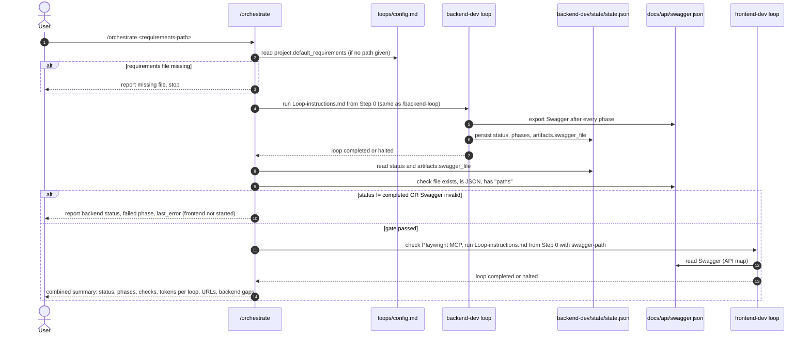
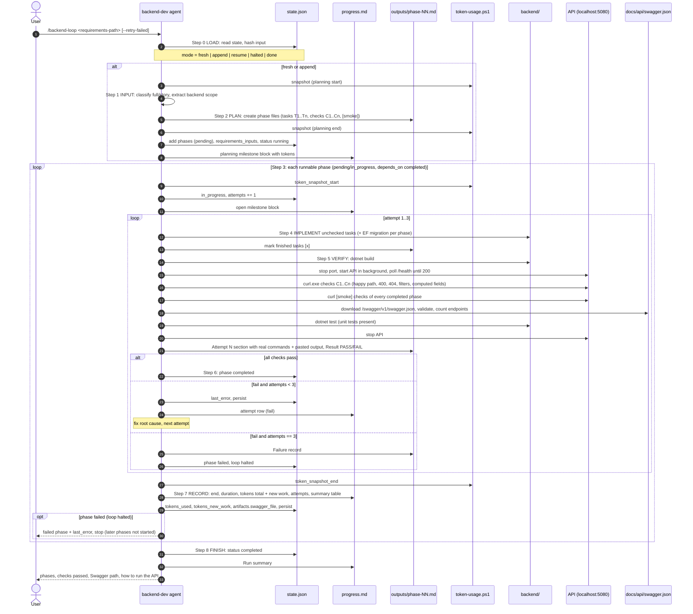
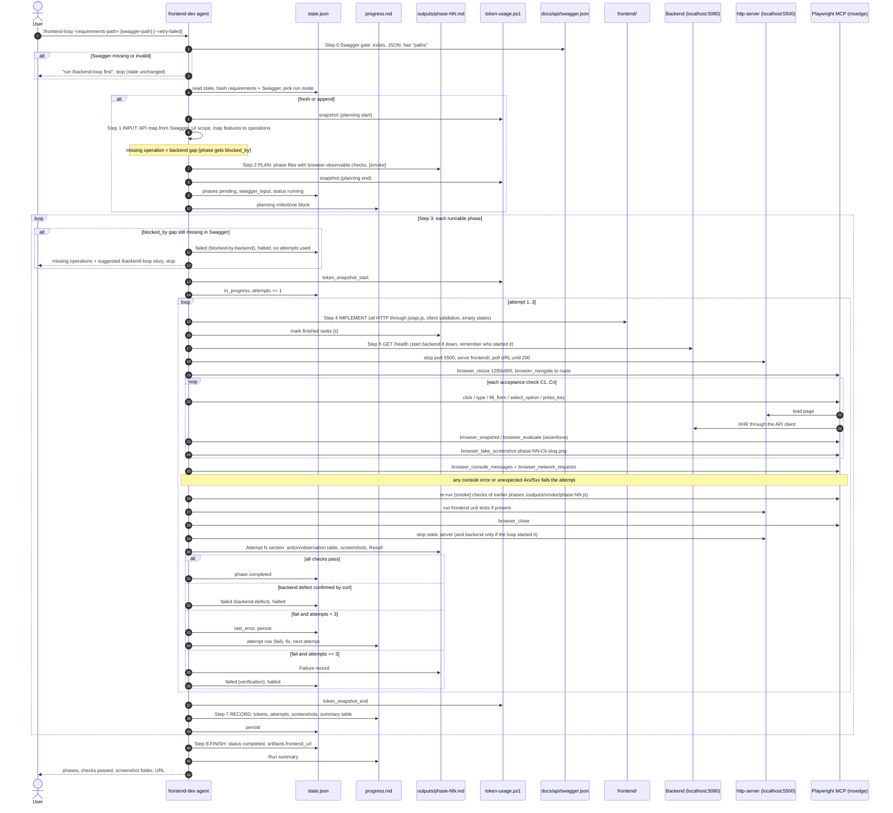

# Claude Loops — QuickFlow

This repository contains **Claude Loops**, two reusable, resumable development loops for
[Claude Code](https://claude.com/claude-code), plus the application they built from
[docs/Task_PRD.md](docs/Task_PRD.md): **QuickFlow**, a personal productivity app with tasks,
habits, learning resources, time-boxed plans and a dashboard.

| Loop | Input | Output | Verified with |
|---|---|---|---|
| **backend-dev** | requirements file | `backend/` code + Swagger/OpenAPI file | `curl` against the running API |
| **frontend-dev** | requirements file + Swagger file | `frontend/` code served at a local URL | Playwright MCP in a real browser |

A third command, `/orchestrate`, runs the backend loop and then the frontend loop, passing the
generated Swagger file between them. It is only a slash command. It has no state of its own.

---

## 1. Purpose and reusability

The loops are written to build **any** application, not just QuickFlow:

- **Any input size.** `<requirements-path>` can be a full PRD or a file with a **single user story**.
  Step 1 of each loop classifies the input as `full` or `story` and extracts the scope that is relevant to that loop.
- **Incremental (append mode).** A new input (a new path, or the same path with a new SHA-256) is
  compared with existing phases and code. Only the new or changed scope is planned, and phase numbers continue
  after the existing ones. If a story needs no change in a loop, the loop records that and finishes with zero new phases.
- **Resumable.** All progress lives in each loop's `state/state.json`. An interrupted run resumes at the
  first `pending`/`in_progress` phase. Completed phases are never re-implemented, only regression-checked
  through their `[smoke]` checks. A halted loop continues with `--retry-failed`.
- **Config, not code.** Every stack choice, folder, port, URL and command is read from
  [loops/config.md](loops/config.md). `Loop-instructions.md`, `task.md`, the templates and the slash commands
  contain no project-specific values. To reuse the loops for another app, edit `config.md` and pass a new requirements file.
- **Bounded retries.** Each phase gets at most `verification.max_attempts` (3) attempts. After the third failure
  the loop records a failure report, sets `status: halted` and stops. It does not continue to later phases.

Global rules that apply to every run are in [CLAUDE.md](CLAUDE.md).

---

## 2. Folder structure

```
QuickFlow/
├── CLAUDE.md                        Global rules for every loop run
├── .mcp.json                        Playwright MCP server (@playwright/mcp 0.0.82, msedge, 1280x800)
├── .claude/commands/
│   ├── backend-loop.md              /backend-loop <requirements> [--retry-failed]
│   ├── frontend-loop.md             /frontend-loop <requirements> [swagger] [--retry-failed]
│   └── orchestrate.md               /orchestrate <requirements>
├── docs/
│   ├── Task_PRD.md                  Requirements (full PRD) used for this run
│   ├── task-description.txt         Assignment brief (context only, not requirements)
│   └── api/swagger.json             Swagger exported by backend-dev, read by frontend-dev
├── loops/
│   ├── config.md                    The only project-specific file in loops/
│   ├── _shared/
│   │   ├── phase-template.md        Template for outputs/phase-NN-<slug>.md
│   │   ├── progress-entry-template.md  Template for one milestone block in progress.md
│   │   └── token-usage.ps1          Reads the session transcript and prints token totals as JSON
│   ├── backend-dev/
│   │   ├── Loop-instructions.md     The algorithm (Steps 0–8), resume rules, record format, state schema
│   │   ├── task.md                  Contract: inputs, outputs, acceptance criteria, out of scope
│   │   ├── progress.md              Milestone log: start/end, tokens, status, attempts, action items
│   │   ├── state/state.json         Machine state used to stop and resume
│   │   └── outputs/phase-NN-*.md    One file per phase: tasks [x], checks [x], pasted curl output
│   └── frontend-dev/
│       ├── Loop-instructions.md
│       ├── task.md
│       ├── progress.md
│       ├── state/state.json
│       └── outputs/
│           ├── phase-NN-*.md        One file per phase: tasks [x], checks [x], Playwright MCP record
│           ├── screenshots/         Screenshots from every check (phase-NN-C<k>-<slug>.png)
│           └── smoke/phase-NN.js    Smoke regression scripts re-run in later phases
├── backend/                         Generated by backend-dev (ASP.NET Core 8, EF Core 8, SQLite)
└── frontend/                        Generated by frontend-dev (HTML/CSS/JS + jQuery 3.7.1, no build step)
```

### What each loop file does

| File | Role |
|---|---|
| `Loop-instructions.md` | The step-by-step algorithm the agent follows: **0 LOAD** (pick run mode: fresh / resume / append / halted / done), **1 INPUT** (classify and extract scope), **2 PLAN** (split into phases, write phase files), **3 START PHASE**, **4 IMPLEMENT**, **5 VERIFY** (never skipped), **6 DECIDE** (pass / retry / halt), **7 RECORD** (tokens, progress.md, state.json), **8 FINISH**. It also defines resume rules, the verification record format and the `state.json` schema. |
| `task.md` | The acceptance contract for a run: required inputs, where each output goes, the acceptance criteria and what is out of scope. |
| `progress.md` | Human-readable log. One block per milestone (planning + each phase) with start, end, duration, tokens (total and new work), status, attempts, action items done, verification summary and attempt history. A summary table sits at the top. |
| `state/state.json` | Machine state: status, mode, requirement inputs with SHA-256, phases with `depends_on`, attempts, token snapshots, `last_error`, artifacts (Swagger path, frontend URL). The loop reads it at Step 0 to decide what to do next. |
| `outputs/phase-NN-<slug>.md` | Created at planning from `_shared/phase-template.md`: goal, tasks T1..Tn, acceptance checks C1..Cn (at least one `[smoke]`). During the run it collects one `### Attempt N` section per attempt with the real commands/tool calls and their pasted output, and a failure record if the phase fails. |
| `_shared/token-usage.ps1` | Sums the `usage` of every assistant message in the current Claude Code session transcript (de-duplicated by message id) and prints `input`, `cache_creation`, `cache_read`, `output`, `total`. Loops call it at milestone start and end and log the difference. |

### Ownership

- **backend-dev** writes only `backend/`, `loops/backend-dev/` and the Swagger export path (`docs/api/swagger.json`).
- **frontend-dev** writes only `frontend/` and `loops/frontend-dev/`. It may start/stop the backend for verification,
  but never edits backend code or the Swagger file. Backend problems are recorded as `blocked-by-backend` or
  `backend-defect` with curl evidence and a suggested `/backend-loop` story.

---

## 3. How to run the loops

All commands run inside Claude Code at the repository root. If `<requirements-path>` is omitted, the loops use
`project.default_requirements` from `loops/config.md` (`docs/Task_PRD.md`).

### Backend loop only
```
/backend-loop docs/Task_PRD.md
/backend-loop docs/stories/US-42.md          # a single user story → appended as new phases
/backend-loop docs/Task_PRD.md --retry-failed  # continue a halted loop
```

### Frontend loop only
Requires the Playwright MCP server from `.mcp.json` (approve it when Claude Code starts).
The Swagger path defaults to `backend.swagger_export_path` (`docs/api/swagger.json`).
```
/frontend-loop docs/Task_PRD.md docs/api/swagger.json
/frontend-loop docs/stories/US-42.md
/frontend-loop docs/Task_PRD.md --retry-failed
```

### Both loops via the orchestrator
```
/orchestrate docs/Task_PRD.md
/orchestrate docs/stories/US-42.md
```
The orchestrator runs backend-dev to the end, then checks a gate: backend `status == completed` **and**
`artifacts.swagger_file` exists and parses as JSON with a `paths` object. Only then does it run frontend-dev
with that Swagger file, and it finishes with one combined report.

> `docs/stories/US-42.md` is only an example path. Any markdown/text file with one user story works.

---

## 4. Sequence diagrams

### 4.1 Orchestrator (`/orchestrate`)



### 4.2 backend-dev loop



### 4.3 frontend-dev loop (Playwright MCP verification)



---

## 5. Results of the QuickFlow run

Input: [docs/Task_PRD.md](docs/Task_PRD.md) (kind `full`, sha256 `D2C19A68…4B41C10B`) for both loops.
The recorded run executed backend-dev (2026-09-24, 12:26–13:12 +03:00) and then frontend-dev with
`docs/api/swagger.json` (17:48–18:46 +03:00), the same order `/orchestrate` uses.
Figures below are copied from [loops/backend-dev/progress.md](loops/backend-dev/progress.md) and
[loops/frontend-dev/progress.md](loops/frontend-dev/progress.md).

**Tokens** are measured with `token-usage.ps1` per milestone:
*total* includes cache reads; *new work* = input + cache write + output.

### 5.1 backend-dev — completed, 7/7 phases, 64/64 checks

| Milestone | Status | Attempts | Checks | Unit tests (cumulative) | Tokens total | Tokens new work |
|---|---|---|---|---|---|---|
| planning | completed | 1 | — | — | 336,576 | 61,836 |
| [phase-01-scaffold](loops/backend-dev/outputs/phase-01-scaffold.md) | completed | 1 / 3 | 8/8 | 3/3 | 2,477,455 | 54,964 |
| [phase-02-tasks](loops/backend-dev/outputs/phase-02-tasks.md) | completed | 1 / 3 | 15/15 | 13/13 | 3,887,260 | 68,504 |
| [phase-03-habits](loops/backend-dev/outputs/phase-03-habits.md) | completed | 1 / 3 | 10/10 | 27/27 | 1,664,862 | 39,510 |
| [phase-04-learning](loops/backend-dev/outputs/phase-04-learning.md) | completed | 1 / 3 | 9/9 | 38/38 | 1,612,588 | 36,029 |
| [phase-05-plans](loops/backend-dev/outputs/phase-05-plans.md) | completed | 1 / 3 | 13/13 | 48/48 | 3,210,784 | 78,032 |
| [phase-06-settings](loops/backend-dev/outputs/phase-06-settings.md) | completed | 1 / 3 | 4/4 | 52/52 | 2,889,636 | 24,386 |
| [phase-07-dashboard](loops/backend-dev/outputs/phase-07-dashboard.md) | completed | 1 / 3 | 5/5 | 56/56 | 2,779,383 | 34,238 |
| **Total** | **completed** | every phase on attempt 1 | **64/64** | **56/56** | **18,858,544** | **397,499** |

- Checks for phases 02–07 were run as scripted curl assertions (214 in total), with smoke regressions of
  every earlier phase after each phase (82 assertions).
- Swagger: `docs/api/swagger.json`, OpenAPI 3.0.1, **26 paths / 41 operations**.

### 5.2 frontend-dev — completed, 7/7 phases, 57/57 checks

| Milestone | Status | Attempts | Checks (final attempt) | Tokens total | Tokens new work |
|---|---|---|---|---|---|
| planning | completed | 1 | — | 294,268 | 32,716 |
| [phase-01-app-shell](loops/frontend-dev/outputs/phase-01-app-shell.md) | completed | 1 / 3 | 6/6 | 3,503,065 | 66,634 |
| [phase-02-tasks](loops/frontend-dev/outputs/phase-02-tasks.md) | completed | 1 / 3 | 9/9 | 10,920,435 | 77,701 |
| [phase-03-habits](loops/frontend-dev/outputs/phase-03-habits.md) | completed | 1 / 3 | 8/8 | 2,675,925 | 34,923 |
| [phase-04-learning](loops/frontend-dev/outputs/phase-04-learning.md) | completed | 1 / 3 | 9/9 | 2,513,998 | 37,691 |
| [phase-05-todo-plans](loops/frontend-dev/outputs/phase-05-todo-plans.md) | completed | **2 / 3** | 10/10 | 13,354,085 | 144,157 |
| [phase-06-dashboard](loops/frontend-dev/outputs/phase-06-dashboard.md) | completed | **2 / 3** | 8/8 | 7,440,894 | 102,801 |
| [phase-07-settings](loops/frontend-dev/outputs/phase-07-settings.md) | completed | 1 / 3 | 7/7 | 3,979,221 | 43,435 |
| **Total** | **completed** | 9 attempts over 7 phases | **57/57** | **44,681,891** | **540,058** |

Failed attempts, both fixed on the next attempt:

| Phase | Attempt | Result | Cause |
|---|---|---|---|
| phase-05-todo-plans | 1 | FAIL 9/10 | Console error `GET /favicon.ico 404` on `tests/plan-time.test.html`, which fails the attempt under `fail_on_console_errors: true` |
| phase-06-dashboard | 1 | FAIL | Smoke regression of phase-05 failed: the plan-start toast (z-index 60) covered the plan-builder modal footer (z-index 50), and completed plans were still notified |

- Every check has at least one screenshot in [loops/frontend-dev/outputs/screenshots/](loops/frontend-dev/outputs/screenshots/).
- 0 console errors and 0 failed network requests in the final attempts; smoke regressions of all earlier phases passed after every phase.
- Unit tests: `frontend/tests/plan-time.test.html`, 26/26.
- Backend gaps / defects: **none**. The client's 41 calls match the 41 Swagger operations.

### 5.3 Both loops

| Loop | Phases | Checks | Attempts | Tokens total | Tokens new work |
|---|---|---|---|---|---|
| backend-dev | 7/7 | 64/64 curl | 7 | 18,858,544 | 397,499 |
| frontend-dev | 7/7 | 57/57 Playwright | 9 | 44,681,891 | 540,058 |
| **Total** | **14/14** | **121/121** | **16** | **63,540,435** | **937,557** |

Totals cover the planning milestone plus all phases of each loop. Work done outside a milestone
(loading context, bookkeeping between phases) is not included; backend-dev's run summary notes about 3.4M
total tokens of such overhead in its session.

---

## 6. Running the application

### Prerequisites
- **.NET SDK** that can build `net8.0` (the run used the .NET 9 SDK) and the **.NET 8 runtime**.
- **Node.js** (for `npx http-server`, which serves the frontend).
- For the frontend loop only: Microsoft Edge (Playwright MCP runs with `--browser msedge`).

### Backend (http://localhost:5080)
```bash
dotnet restore backend/QuickFlow.sln
dotnet run --project backend/src/QuickFlow.Api --no-launch-profile -- --urls http://localhost:5080 --environment Development
```
- Swagger UI: http://localhost:5080/swagger · OpenAPI JSON: http://localhost:5080/swagger/v1/swagger.json
- Health: http://localhost:5080/health
- The SQLite database `backend/src/QuickFlow.Api/quickflow.db` is created by EF Core migrations at startup (it is git-ignored).
- Unit tests: `dotnet test backend/QuickFlow.sln`
- Stop (PowerShell):
  ```powershell
  Get-NetTCPConnection -LocalPort 5080 -State Listen -ErrorAction SilentlyContinue | ForEach-Object { Stop-Process -Id $_.OwningProcess -Force }
  ```

### Frontend (http://localhost:5500)
Start the backend first: the frontend calls `http://localhost:5080` (set in `frontend/js/config.js`),
and CORS allows `http://localhost:5500` and `http://127.0.0.1:5500`.
```bash
npx --yes http-server frontend -p 5500 -c-1 --silent
```
- Open http://localhost:5500 (routes: `#/dashboard`, `#/tasks`, `#/habits`, `#/learning`, `#/plans`, `#/settings`).
- Frontend unit tests: open http://localhost:5500/tests/plan-time.test.html.
- Stop (PowerShell):
  ```powershell
  Get-NetTCPConnection -LocalPort 5500 -State Listen -ErrorAction SilentlyContinue | ForEach-Object { Stop-Process -Id $_.OwningProcess -Force }
  ```

All of these commands come from [loops/config.md](loops/config.md).
