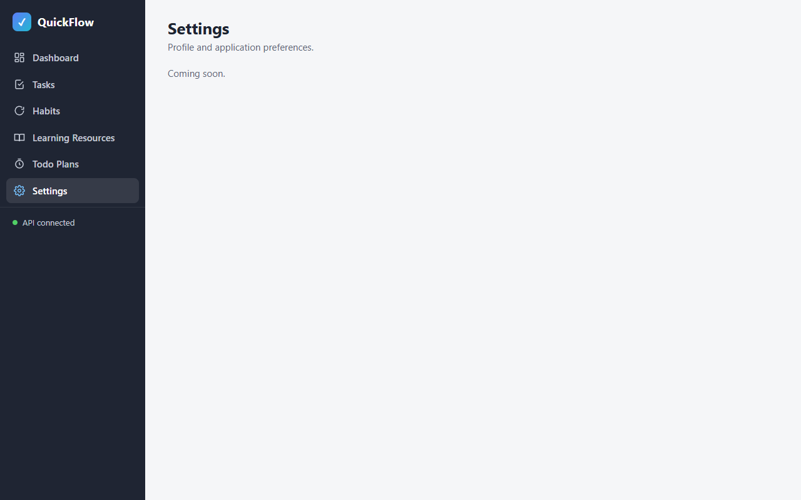
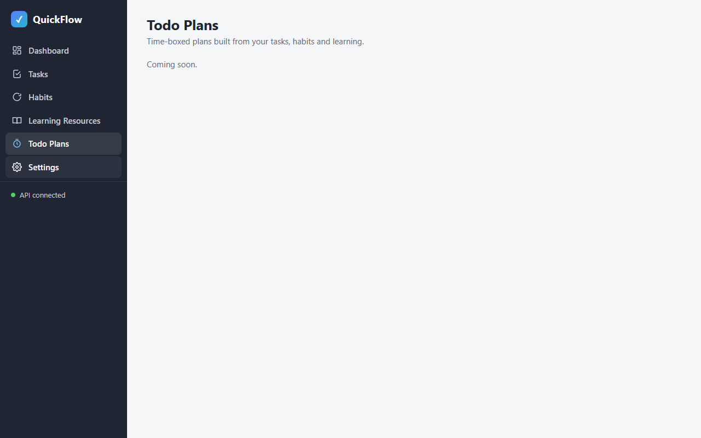
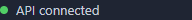
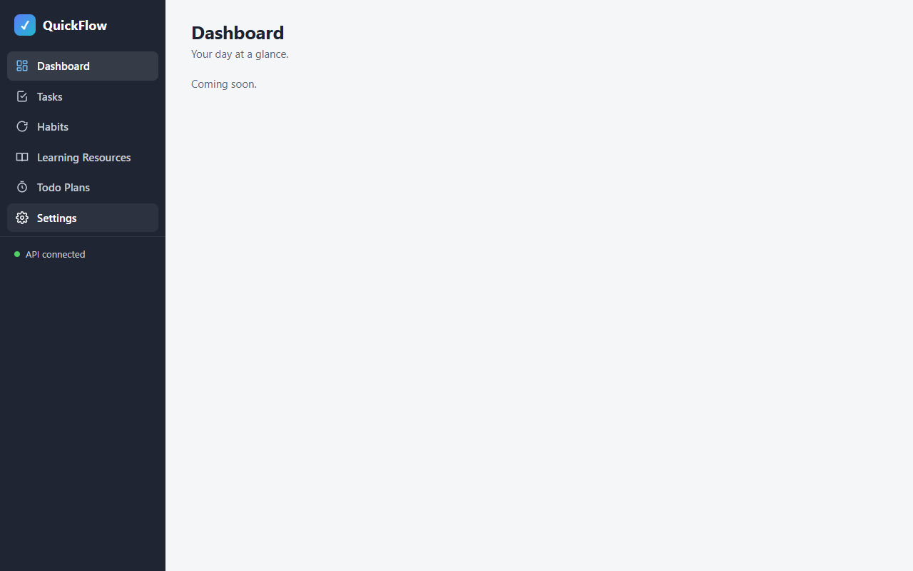

# phase-01-app-shell — App shell, navigation & API client

| Field | Value |
|---|---|
| Loop | frontend-dev |
| Status | completed |
| Attempts | 1 / 3 |
| Depends on | — |
| Requirements covered | §4 Application Structure, §8 Main Navigation, §13 DoD (six pages reachable from persistent navigation), NFR Maintainability (presentation vs computation) |
| Requirements source | docs/Task_PRD.md |
| Started | 2026-09-24T17:51:58+03:00 |
| Ended | 2026-09-24T17:57:39+03:00 |

## Goal
A static single-page app shell served from `frontend/`: persistent navigation to all six pages, hash routing,
base styles, a shared API client covering every Swagger operation, and shared UI helpers. Each page shows its heading.

## Tasks
<!-- Mark [x] only when the task is implemented AND covered by a passing check. -->
- [x] T1 `frontend/index.html` entry page: persistent nav (Dashboard, Tasks, Habits, Learning Resources, Todo Plans, Settings), main outlet, script includes
- [x] T2 Vendor jQuery 3.7.1 into `frontend/vendor/jquery-3.7.1.min.js` (no CDN at runtime)
- [x] T3 `frontend/js/config.js` with `window.APP_CONFIG = { apiBaseUrl: "http://localhost:5080" }`
- [x] T4 `frontend/js/api.js` shared API client for all Swagger operations, ProblemDetails normalization
- [x] T5 `frontend/js/lib/router.js` hash router (`#/route?query`), active-link highlight (`aria-current`), unknown route → `#/dashboard`
- [x] T6 `frontend/js/lib/ui.js` (loading, error/ProblemDetails, empty state, toast, modal, confirm) and `frontend/js/lib/format.js` (date/time helpers)
- [x] T7 `frontend/css/styles.css` base layout and components
- [x] T8 Page modules `frontend/js/pages/*.js` (one per page) with heading; nav API status indicator via `GET /health`

## Acceptance checks
- [x] C1 [smoke] Opening the frontend URL shows the nav with the 6 links and lands on `#/dashboard` with heading "Dashboard"
- [x] C2 [smoke] Clicking each nav link changes the hash to its route, shows that page's heading, and marks the link active (`aria-current="page"`)
- [x] C3 Unknown route `#/nope` redirects to `#/dashboard`
- [x] C4 [smoke] Nav API status indicator shows "API connected" (browser `GET /health` → 200, CORS accepted)
- [x] C5 Browser Back returns to the previous route and page
- [x] C6 `jQuery.fn.jquery === "3.7.1"` loaded from the local vendor path; no requests to external hosts; no console errors

## Verification

### Attempt 1 — 2026-09-24T17:55:38+03:00
**Backend:** already running (health 200, `{"status":"Healthy","database":"Connected"}`) — not started by loop
**Static server:** PASS (`npx --yes http-server frontend -p 5500 -c-1 --silent` → 200 on first poll)
**Viewport:** 1280x800 (`browser_resize`)

#### C1 [smoke] Landing on root shows nav with 6 links and #/dashboard
| # | Action (MCP tool) | Target / input | Observation |
|---|---|---|---|
| 1 | browser_navigate | `http://localhost:5500/` | URL became `http://localhost:5500/#/dashboard`, title "Dashboard · QuickFlow" |
| 2 | browser_snapshot | page | navigation "Main navigation" with links Dashboard, Tasks, Habits, Learning Resources, Todo Plans, Settings; heading "Dashboard" [level=1]; status "API connected" |
| 3 | browser_evaluate | hash, nav links, h1, aria-current | `{"hash":"#/dashboard","links":["Dashboard","Tasks","Habits","Learning Resources","Todo Plans","Settings"],"h1":"Dashboard","current":["dashboard"],"apiStatus":"ok / API connected"}` |

Expected: 6 nav links, hash `#/dashboard`, heading "Dashboard"
Actual: as expected
Screenshot: 
Result: **PASS**

#### C2 [smoke] Each nav link routes, shows heading, marks link active
| # | Action (MCP tool) | Target / input | Observation |
|---|---|---|---|
| 1 | browser_click | link "Tasks" | URL `#/tasks`, title "Tasks · QuickFlow" |
| 2 | browser_evaluate | hash/h1/aria-current | `{"hash":"#/tasks","h1":"Tasks","current":["Tasks"]}` |
| 3 | browser_click | link "Habits" | URL `#/habits` |
| 4 | browser_evaluate | hash/h1/aria-current | `{"hash":"#/habits","h1":"Habits","current":["Habits"]}` |
| 5 | browser_click | link "Learning Resources" | URL `#/learning` |
| 6 | browser_evaluate | hash/h1/aria-current | `{"hash":"#/learning","h1":"Learning Resources","current":["Learning Resources"]}` |
| 7 | browser_click | link "Todo Plans" | URL `#/plans` |
| 8 | browser_evaluate | hash/h1/aria-current | `{"hash":"#/plans","h1":"Todo Plans","current":["Todo Plans"]}` |
| 9 | browser_click | link "Settings" | URL `#/settings` |
| 10 | browser_evaluate | hash/h1/aria-current | `{"hash":"#/settings","h1":"Settings","current":["Settings"]}` |

Expected: each click → matching hash, heading and single active link (Dashboard covered by C1)
Actual: as expected for all 5 clicks
Screenshot: 
Result: **PASS**

#### C5 Browser Back returns to the previous route
| # | Action (MCP tool) | Target / input | Observation |
|---|---|---|---|
| 1 | browser_navigate_back | from `#/settings` | URL `#/plans`, title "Todo Plans · QuickFlow" |
| 2 | browser_evaluate | hash/h1/aria-current | `{"hash":"#/plans","h1":"Todo Plans","current":["Todo Plans"]}` |

Expected: previous route `#/plans` rendered
Actual: as expected
Screenshot: 
Result: **PASS**

#### C3 Unknown route redirects to #/dashboard
| # | Action (MCP tool) | Target / input | Observation |
|---|---|---|---|
| 1 | browser_navigate | `http://localhost:5500/#/nope` | URL became `http://localhost:5500/#/dashboard`, title "Dashboard · QuickFlow" |
| 2 | browser_evaluate | hash/h1 | `"hash":"#/dashboard","h1":"Dashboard"` |

Expected: redirect to `#/dashboard`
Actual: as expected
Screenshot: 
Result: **PASS**

#### C4 [smoke] API status indicator shows "API connected"
| # | Action (MCP tool) | Target / input | Observation |
|---|---|---|---|
| 1 | browser_snapshot | sidebar footer | `status: API connected` (C1 step 2) |
| 2 | browser_evaluate | `#api-status` | `"apiStatus":"ok / API connected"` |
| 3 | browser_network_requests | — | `[GET] http://localhost:5080/health => [200] OK` (cross-origin from :5500, CORS accepted) |

Expected: indicator "API connected", /health 200
Actual: as expected
Screenshot: 
Result: **PASS**

#### C6 Local jQuery 3.7.1, no external hosts, no console errors
| # | Action (MCP tool) | Target / input | Observation |
|---|---|---|---|
| 1 | browser_evaluate | `jQuery.fn.jquery`, first script src, resource hosts | `{"jquery":"3.7.1","jqSrc":"vendor/jquery-3.7.1.min.js","resourceHosts":["localhost:5500","localhost:5080"]}` |
| 2 | browser_console_messages | level info, all | `Total messages: 0 (Errors: 0, Warnings: 0)` |

Expected: jQuery 3.7.1 from vendor, only localhost hosts, 0 console errors
Actual: as expected
Screenshot: 
Result: **PASS**

#### Console & network
- Console errors: 0 (`Total messages: 0 (Errors: 0, Warnings: 0)`)
- Failed requests: 0 (`[GET] http://localhost:5080/health => [200] OK`)

#### Smoke regression
| Check | Result |
|---|---|
| — (first phase) | n/a |

**Unit tests:** not present (optional)
**Teardown:** `browser_close` → "No open tabs"; frontend stop command → port 5500 no longer answering (curl 000); backend left running (not started by loop)
**Result:** PASS 6/6

## Unit tests (optional)
- Command: —
- Result: —

## Failure record
—

## Notes
- jQuery vendored from https://code.jquery.com/jquery-3.7.1.min.js (87,533 bytes, sha256 fc9a93dd…0b1a).
- Snapshot `.yml` files the MCP server writes into the screenshot folder are removed at teardown; only PNG evidence is kept.
