# phase-02-tasks — Tasks page

| Field | Value |
|---|---|
| Loop | frontend-dev |
| Status | completed |
| Attempts | 1 / 3 |
| Depends on | phase-01-app-shell |
| Requirements covered | US Tasks 1-7, FR-01, FR-02, BR-1..5, §8 Tasks Page, §12 AC Tasks, NFR Usability |
| Requirements source | docs/Task_PRD.md |
| Started | 2026-09-24T17:59:34+03:00 |
| Ended | 2026-09-24T18:08:28+03:00 |

## Goal
Users can create, edit, complete, archive/restore and delete tasks, and search, filter (status, priority, due date, overdue)
and sort them on the Tasks page, with a guiding empty state.

## Tasks
<!-- Mark [x] only when the task is implemented AND covered by a passing check. -->
- [x] T1 Task list: title, description snippet, status and priority badges, due date, overdue flag, archived badge
- [x] T2 Toolbar: search (debounced), status filter, priority filter, due-date filter, overdue-only, sort by due/created + direction, view Active/Archived/All
- [x] T3 Add Task modal with client validation (title required ≤200, description ≤2000, status, priority, due date) and server ProblemDetails display
- [x] T4 Edit task (same form, `PUT /api/tasks/{id}`)
- [x] T5 Complete (`POST …/complete`), archive/restore, delete with confirmation
- [x] T6 Empty state with "Add Task" button; "no matches" state with "Clear filters"
- [x] T7 Quick-add route `#/tasks?new=1` opens the Add Task form

## Acceptance checks
- [x] C1 [smoke] With no tasks, the page shows the empty state whose "Add Task" button opens the form
- [x] C2 Creating a task through the form adds its row (`POST /api/tasks` → 201)
- [x] C3 Validation: empty title shows "Title is required." and sends no request; title input is limited to 200 chars
- [x] C4 Editing a task's title and priority updates its row (`PUT` → 200)
- [x] C5 Completing a task shows status "Done"
- [x] C6 Search by title and the status/priority filters narrow the list (requests carry `Search`/`Status`/`Priority`)
- [x] C7 A task with a past due date shows "Overdue"; the overdue-only filter lists only overdue tasks; sort by due date orders rows
- [x] C8 Archiving hides the task from the default list; the Archived view shows it; Restore brings it back
- [x] C9 [smoke] Deleting a task (after confirming) removes its row

## Verification

### Attempt 1 — 2026-09-24T18:00:59+03:00
**Backend:** already running (health 200) — not started by loop
**Static server:** PASS (`npx --yes http-server frontend -p 5500 -c-1 --silent` → 200 in 1 s)
**Viewport:** 1280x800 (`browser_resize`)
**Test-data setup (curl):** deleted the 12 leftover backend-loop tasks (`DELETE /api/tasks/{19,18,17,16,11,8,7,6,5,4,2,1}` → 204 each; `GET /api/tasks?Archived=Include` → `[]`). After C2, seeded for C6–C8: `POST /api/tasks` "Buy groceries" (Low, due 2026-09-20, id 23, `isOverdue:true`) → 201 and "Call the bank" (InProgress, Medium, due 2026-09-24, id 24) → 201.

#### C1 [smoke] Empty state with Add Task opens the form
| # | Action (MCP tool) | Target / input | Observation |
|---|---|---|---|
| 1 | browser_navigate | `http://localhost:5500/#/tasks` | title "Tasks · QuickFlow" |
| 2 | browser_snapshot | main | heading "No tasks yet", paragraph "Add your first task to start organizing your work.", button "Add Task" |
| 3 | browser_click | empty-state "Add Task" (e83) | dialog: heading "Add task", textbox "Title" [active], Description, Status (Todo), Priority (Medium), Due date, buttons Cancel / Add task |

Expected: empty state guiding to Add Task; button opens the form
Actual: as expected
Screenshot: 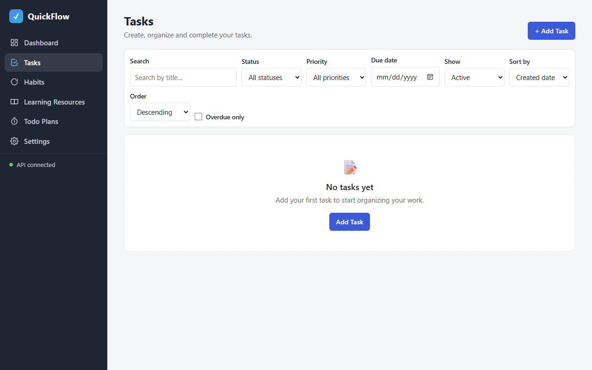
Result: **PASS**

#### C3 Validation: empty title, 200-char limit
| # | Action (MCP tool) | Target / input | Observation |
|---|---|---|---|
| 1 | browser_click | "Add task" submit with empty title | dialog stays open |
| 2 | browser_evaluate | form state | `{"dialogOpen":true,"titleError":"Title is required.","ariaInvalid":"true","titleMaxLength":200}` |
| 3 | browser_network_requests | — | only `[GET] /api/tasks?Archived=Exclude&SortBy=CreatedAt&SortDir=Desc => 200`; no POST |
| 4 | browser_type | Title = 205 × "a" | — |
| 5 | browser_evaluate | title value length | `{"typedLength":205,"valueLength":200}` |

Expected: "Title is required." and no request; input capped at 200
Actual: as expected
Screenshot: 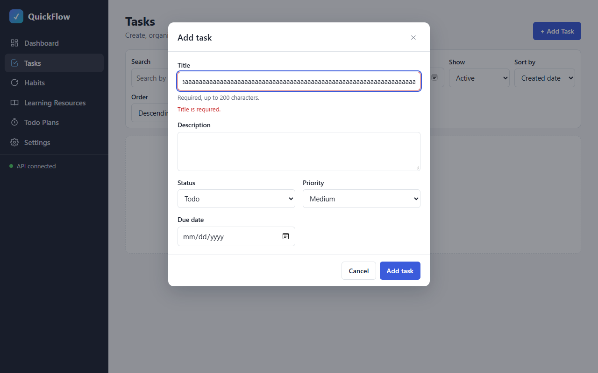
Result: **PASS**

#### C2 Create a task through the form
| # | Action (MCP tool) | Target / input | Observation |
|---|---|---|---|
| 1 | browser_fill_form | Title "Write project report", Description "Quarterly summary for the team", Priority High, Due date 2026-09-25 | — |
| 2 | browser_click | "Add task" | dialog closed |
| 3 | browser_network_requests | /api/tasks | `[POST] http://localhost:5080/api/tasks => [201] Created` then list GET 200 |
| 4 | browser_snapshot | #page | "1 task"; listitem "Task Write project report" with "Quarterly summary for the team", badges Todo / High priority, "Due Tomorrow"; buttons Edit/Archive/Delete |

Expected: new row visible, empty state gone
Actual: as expected
Screenshot: 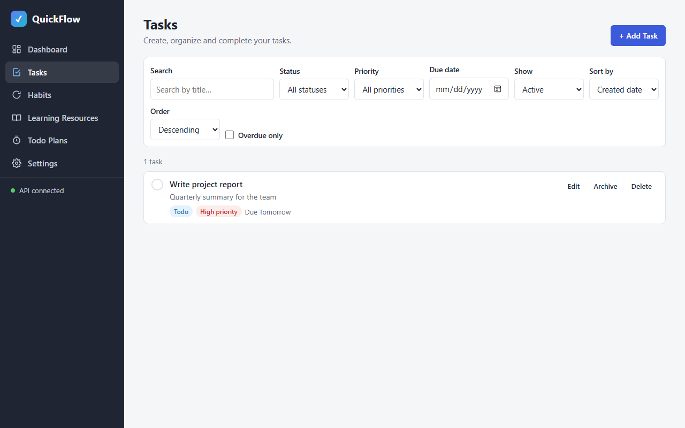
Result: **PASS**

#### C4 Edit title and priority
| # | Action (MCP tool) | Target / input | Observation |
|---|---|---|---|
| 1 | browser_click | "Edit Write project report" | dialog "Edit task" prefilled (title, description, High, 2026-09-25) |
| 2 | browser_fill_form | Title "Write quarterly report", Priority Medium | — |
| 3 | browser_click | "Save changes" | `[PUT] http://localhost:5080/api/tasks/22 => [200] OK` |
| 4 | browser_snapshot | #task-results | listitem "Task Write quarterly report": badges Todo / Medium priority, "Due Tomorrow" |

Expected: row shows new title and priority
Actual: as expected
Screenshot: 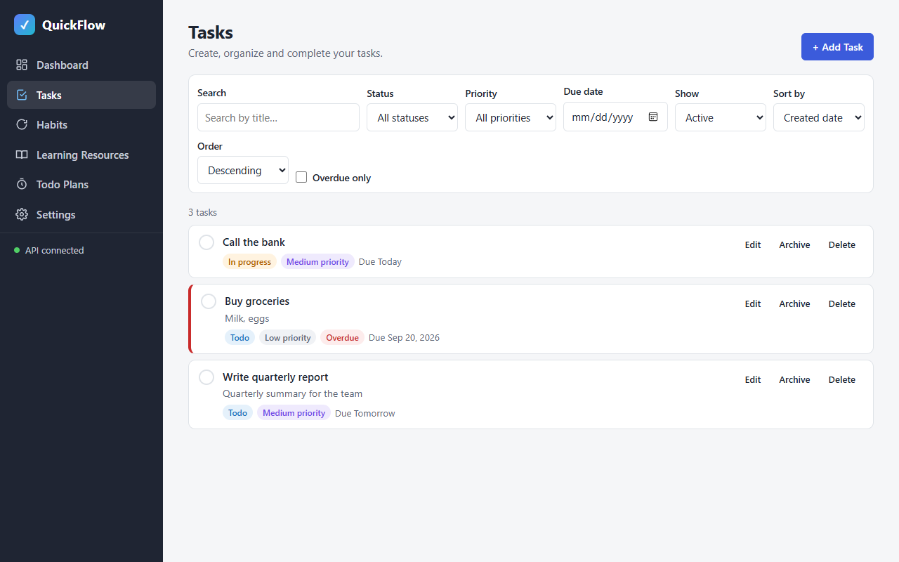
Result: **PASS**

#### C5 Complete a task
| # | Action (MCP tool) | Target / input | Observation |
|---|---|---|---|
| 1 | browser_click | "Complete Write quarterly report" | `[POST] http://localhost:5080/api/tasks/22/complete => [200] OK` |
| 2 | browser_evaluate | rows | `{"title":"Write quarterly report","struck":true,"badges":["Done","Medium priority"],"toggle":"Write quarterly report is done"}` |

Expected: status "Done"
Actual: as expected
Screenshot: 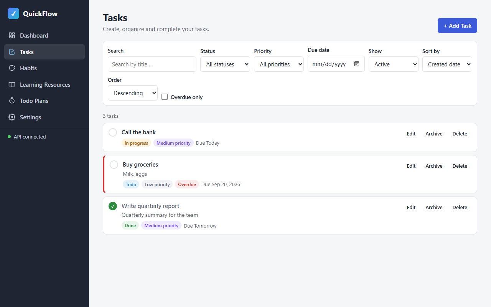
Result: **PASS**

#### C6 Search and status/priority filters
| # | Action (MCP tool) | Target / input | Observation |
|---|---|---|---|
| 1 | browser_type | Search = "bank" | `GET /api/tasks?Search=bank&Archived=Exclude&SortBy=CreatedAt&SortDir=Desc => 200` |
| 2 | browser_evaluate | rows | `{"rows":["Call the bank"],"count":"1 task"}` |
| 3 | browser_type + browser_select_option | Search = "", Status = Done | `GET /api/tasks?Status=Done&… => 200` |
| 4 | browser_evaluate | rows | `{"rows":["Write quarterly report"]}` |
| 5 | browser_select_option ×2 | Status = All, Priority = Low | `GET /api/tasks?Priority=Low&… => 200` |
| 6 | browser_evaluate | rows | `{"rows":["Buy groceries"]}` |

Expected: each filter narrows the list; requests carry Search/Status/Priority
Actual: as expected
Screenshots: 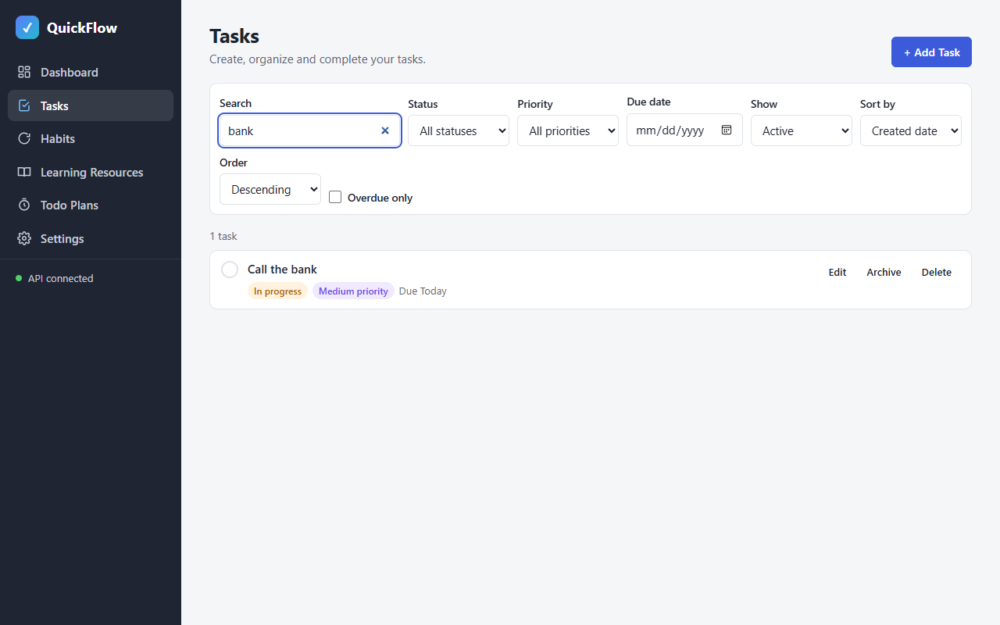 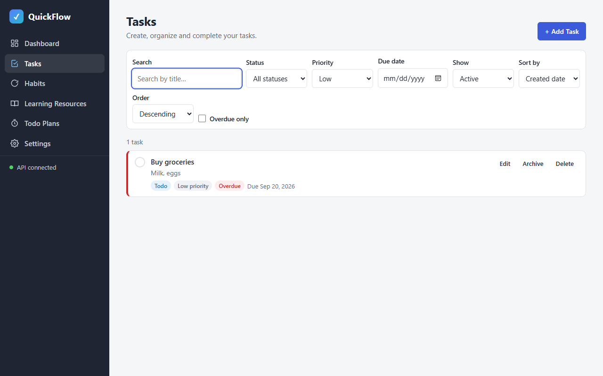
Result: **PASS**

#### C7 Overdue flag, overdue filter, due-date sort (and due-date filter)
| # | Action (MCP tool) | Target / input | Observation |
|---|---|---|---|
| 1 | browser_snapshot (C4 step 4) | "Buy groceries" row | badges Todo / Low priority / **Overdue**, "Due Sep 20, 2026" |
| 2 | browser_select_option + browser_click | Priority = All, "Overdue only" checked | `GET /api/tasks?Overdue=true&… => 200` |
| 3 | browser_evaluate | rows | `["Buy groceries \| overdueBadge=true \| redBorder=true"]` |
| 4 | browser_click + browser_select_option ×2 | uncheck overdue, Sort by = Due date, Order = Ascending | `GET /api/tasks?Archived=Exclude&SortBy=DueDate&SortDir=Asc => 200` |
| 5 | browser_evaluate | rows | `["Buy groceries \| Due Sep 20, 2026","Call the bank \| Due Today","Write quarterly report \| Due Tomorrow"]` |
| 6 | browser_fill_form | Due date filter = 2026-09-24 | `GET /api/tasks?DueDate=2026-09-24&… => 200` |
| 7 | browser_evaluate | rows | `{"rows":["Call the bank"],"dueFilter":"2026-09-24"}` |

Expected: overdue task flagged; overdue filter lists only it; ascending due-date order; due-date filter exact
Actual: as expected
Screenshots: 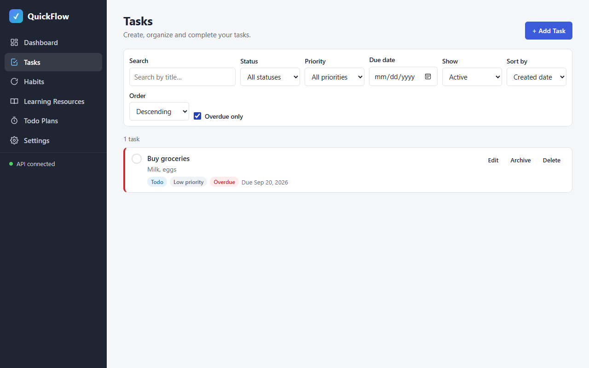 
Result: **PASS**

#### C8 Archive, archived view, restore
| # | Action (MCP tool) | Target / input | Observation |
|---|---|---|---|
| 1 | browser_click | "Archive Call the bank" | `[POST] /api/tasks/24/archive => [200] OK` |
| 2 | browser_evaluate | Active view rows | `{"view":"Exclude","rows":["Buy groceries","Write quarterly report"]}` |
| 3 | browser_select_option | Show = Archived | `GET /api/tasks?Archived=Only&… => 200` |
| 4 | browser_evaluate | rows | `["Call the bank \| In progress,Medium priority,Archived \| actions=Edit/Restore/Delete"]` |
| 5 | browser_click | "Restore Call the bank" | `[POST] /api/tasks/24/restore => [200] OK`; archived view shows "No archived tasks" |
| 6 | browser_select_option + browser_evaluate | Show = Active | `{"view":"Exclude","rows":["Buy groceries","Call the bank","Write quarterly report"]}` |

Expected: archived task hidden by default, visible in Archived view, back after Restore
Actual: as expected
Screenshots: 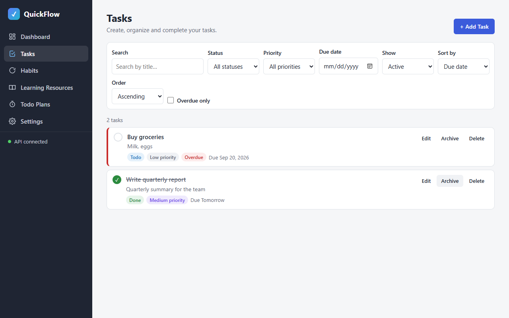 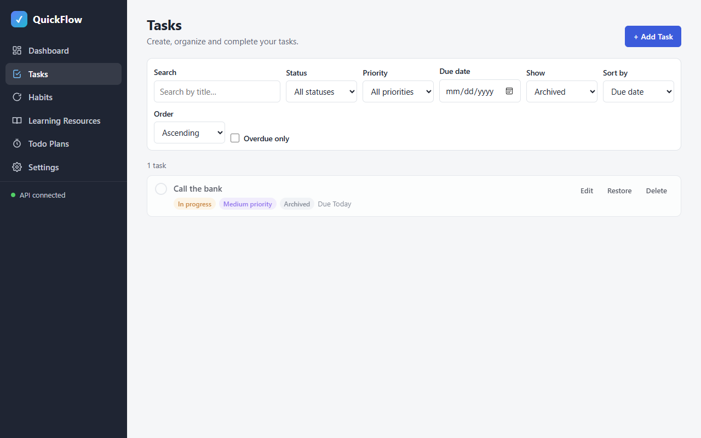 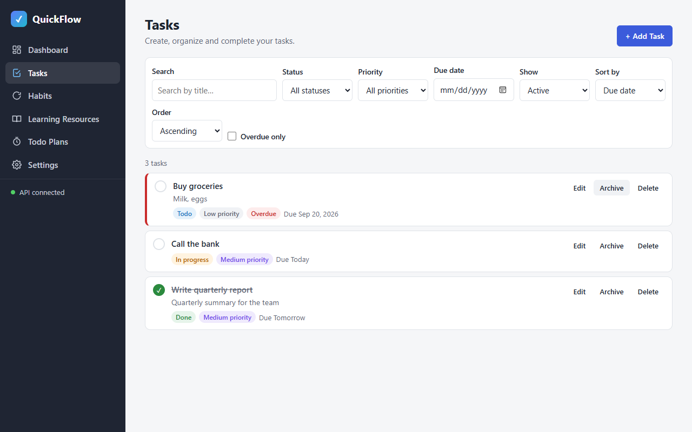
Result: **PASS**

#### C9 [smoke] Delete after confirming
| # | Action (MCP tool) | Target / input | Observation |
|---|---|---|---|
| 1 | browser_click | "Delete Buy groceries" | dialog "Delete task": `Delete "Buy groceries"? This cannot be undone.`, buttons Cancel / Delete |
| 2 | browser_click | "Delete" | `[DELETE] http://localhost:5080/api/tasks/23 => [204] No Content` |
| 3 | browser_evaluate | rows | `{"dialogOpen":false,"rows":["Call the bank","Write quarterly report"]}` |

Expected: row removed after confirmation
Actual: as expected
Screenshots: 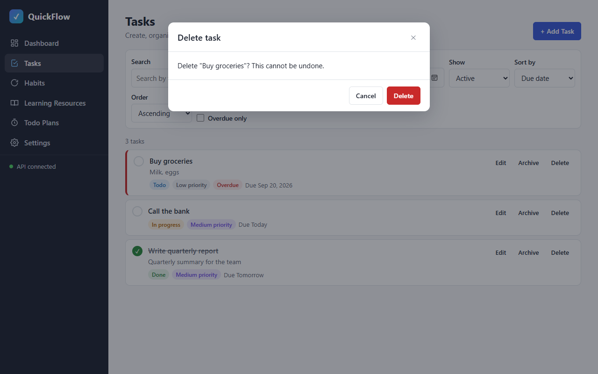 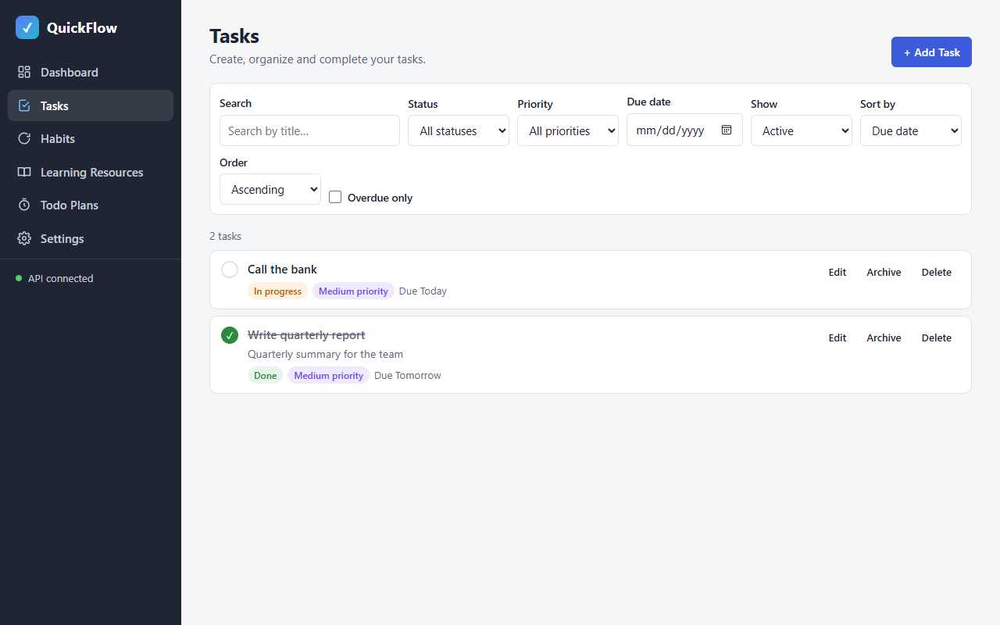
Result: **PASS**

#### T7 Quick-add route (extra check for task T7)
| # | Action (MCP tool) | Target / input | Observation |
|---|---|---|---|
| 1 | browser_navigate | `http://localhost:5500/#/tasks?new=1` | URL rewritten to `#/tasks` |
| 2 | browser_evaluate | dialog | `{"hash":"#/tasks","dialogTitle":"Add task","focused":"tf-title"}` |

Screenshot: 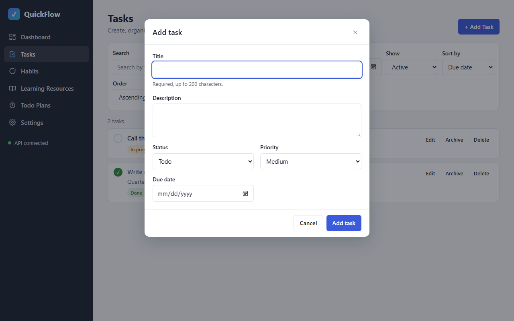
Result: **PASS**

#### Console & network
- Console errors: 0 (`browser_console_messages` all: `Total messages: 0 (Errors: 0, Warnings: 0)`, before and after the smoke runs)
- Failed requests: 0 — full list #16–#55 all 2xx (GET list 200, POST 201, PUT 200, complete/archive/restore 200, DELETE 204, health 200)

#### Smoke regression
Scripts: [`smoke/phase-01.js`](smoke/phase-01.js), [`smoke/phase-02.js`](smoke/phase-02.js), run with `browser_run_code_unsafe` (real clicks/typing).

| Check | Result | Observation |
|---|---|---|
| phase-01 C1 | PASS | `{"hash":"#/dashboard","links":["Dashboard","Tasks","Habits","Learning Resources","Todo Plans","Settings"],"h1":"Dashboard"}` |
| phase-01 C2 | PASS | `["#/tasks Tasks active=Tasks","#/habits Habits active=Habits","#/learning Learning Resources active=Learning Resources","#/plans Todo Plans active=Todo Plans","#/settings Settings active=Settings","#/dashboard Dashboard active=Dashboard"]` |
| phase-01 C4 | PASS | `"API connected"` — screenshot 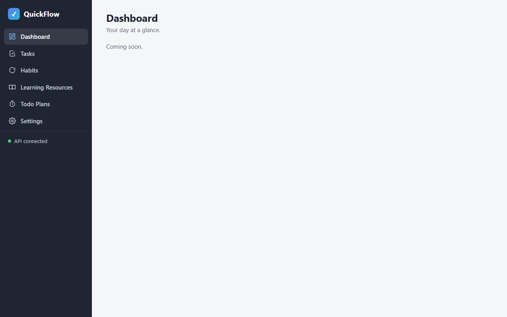 |
| phase-02 smoke script (self-check for later phases) | PASS | `{"C1":"empty state → dialog \"Add task\"","C9":"created and deleted \"Smoke task 1790262491190\"; rows now: 2"}` |

**Unit tests:** not present (optional)
**Teardown:** `browser_close` → "No open tabs"; frontend stop → port 5500 curl 000; backend left running
**Result:** PASS 9/9

## Unit tests (optional)
- Command: —
- Result: —

## Failure record
—

## Notes
- Test data: leftover backend-loop tasks were deleted through the API for the empty-state check; two tasks were seeded through the API for the filter checks (creation through the UI is covered by C2).
- Smoke regression for later phases uses [smoke/phase-02.js](smoke/phase-02.js): since other data exists by then, C1 is re-checked through the no-match empty state (same Add Task action), plus an add → delete round trip for C9.
