# phase-03-habits — Habits page

| Field | Value |
|---|---|
| Loop | frontend-dev |
| Status | completed |
| Attempts | 1 / 3 |
| Depends on | phase-01-app-shell |
| Requirements covered | US Habits 1-5, FR-03, FR-04, BR-6, BR-7, §8 Habits Page, §12 AC Habits, NFR Usability |
| Requirements source | docs/Task_PRD.md |
| Started | 2026-09-24T18:09:53+03:00 |
| Ended | 2026-09-24T18:12:28+03:00 |

## Goal
Users can create daily/weekly habits, complete them for today (no duplicates), see progress and streaks,
edit, deactivate/activate and remove habits, with a guiding empty state.

## Tasks
<!-- Mark [x] only when the task is implemented AND covered by a passing check. -->
- [x] T1 Habit cards: name, description, frequency label, streak, total completions, done-today state, inactive badge
- [x] T2 Add/Edit habit modal (name required ≤150, description ≤2000, frequency Daily/Weekly)
- [x] T3 Completion toggle: complete for today (`POST …/completions`), undo (`DELETE …/completions/{today}`), 409 shown as message
- [x] T4 Deactivate/activate, remove with confirmation
- [x] T5 Filter Active/Inactive/All and a "completed today x / y" progress summary
- [x] T6 Empty state with "Add Habit"; quick-add route `#/habits?new=1`

## Acceptance checks
- [x] C1 [smoke] With no habits, the page shows the empty state whose "Add Habit" button opens the form
- [x] C2 Creating a Daily and a Weekly habit shows two cards labelled "Daily" and "Weekly"
- [x] C3 Validation: empty name shows "Name is required." and sends no request
- [x] C4 Completing a habit for today marks the card done, streak 1, summary "1 / 2"; after reload it is still done once (no duplicate control offered)
- [x] C5 Undoing today's completion returns the card to not done
- [x] C6 Editing a habit's name and frequency updates the card
- [x] C7 Deactivating shows "Inactive" and hides it from the Active filter; Activate restores it
- [x] C8 [smoke] Removing a habit (after confirming) removes its card

## Verification

### Attempt 1 — 2026-09-24T18:10:51+03:00
**Backend:** already running (health 200) — not started by loop
**Static server:** PASS (`npx --yes http-server frontend -p 5500 -c-1 --silent` → 200 in 1 s)
**Viewport:** 1280x800 (`browser_resize`)
**Test-data setup (curl):** deleted the 4 leftover backend-loop habits (`DELETE /api/habits/{1,2,5,9}` → 204 each; `GET /api/habits` → `[]`). All habits in this phase were created through the UI.
**Method:** multi-step flows were driven with `browser_run_code_unsafe` (real Playwright clicks/fills on the served page, `page.on('response')` capturing API calls); each block below quotes the returned JSON verbatim.

#### C1 [smoke] Empty state with Add Habit opens the form
| # | Action (MCP tool) | Target / input | Observation |
|---|---|---|---|
| 1 | browser_run_code_unsafe → `page.goto` | `http://localhost:5500/#/habits` | `GET /api/habits => 200` |
| 2 | ↳ evaluate | empty state | `{"h2":"No habits yet","text":"Add a daily or weekly habit and check it off each day.","button":"Add Habit","summary":"Completed today: 0 / 0 active"}` |
| 3 | ↳ click | empty-state "Add Habit" | dialog heading `"Add habit"` |

Expected: guiding empty state; Add Habit opens the form
Actual: as expected
Screenshot: 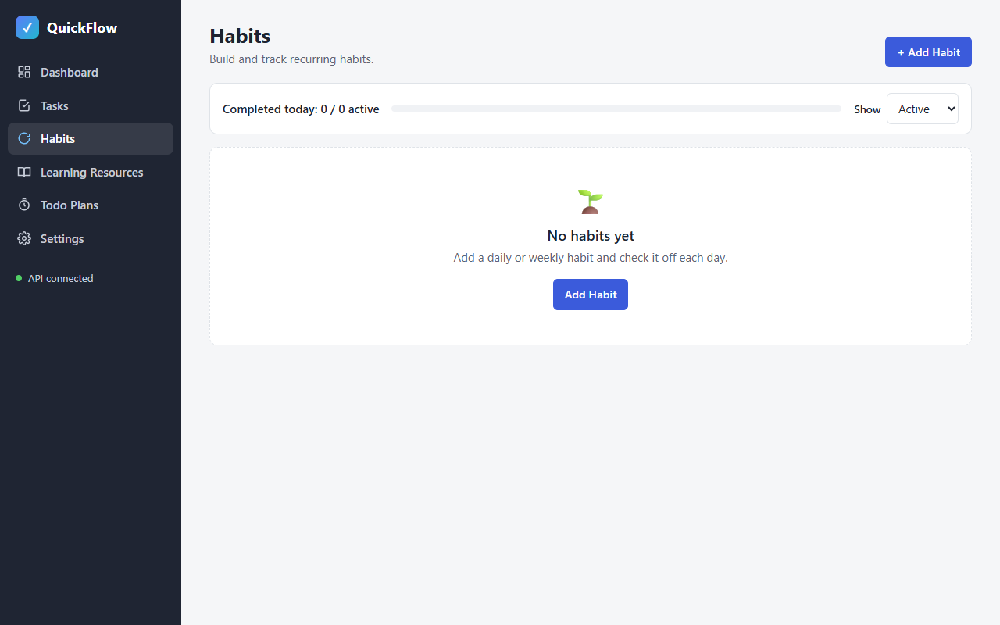
Result: **PASS**

#### C3 Validation: empty name
| # | Action (MCP tool) | Target / input | Observation |
|---|---|---|---|
| 1 | ↳ click | "Add habit" with empty name | `{"dialogOpen":true,"nameError":"Name is required.","nameMaxLength":150}` |
| 2 | ↳ response log | during invalid submit | `[]` (no request sent) |

Expected: "Name is required.", no request
Actual: as expected
Screenshot: 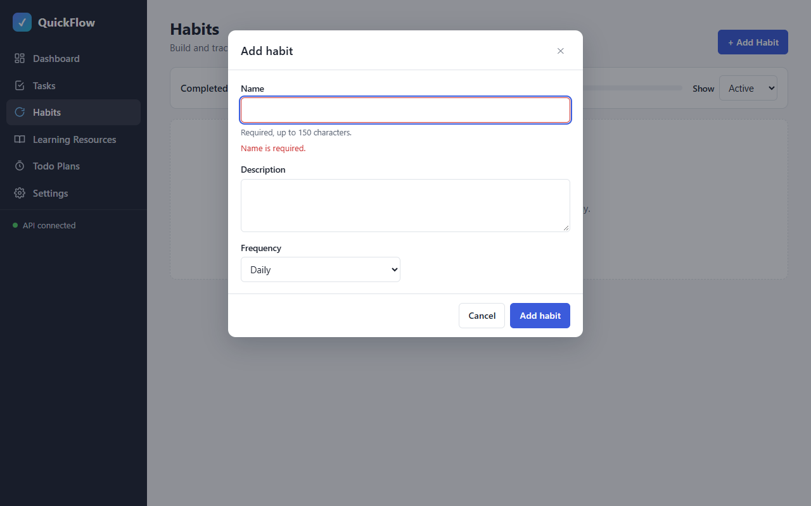
Result: **PASS**

#### C2 Create a Daily and a Weekly habit
| # | Action (MCP tool) | Target / input | Observation |
|---|---|---|---|
| 1 | ↳ fill + select + click | Name "Morning run", Description "20 minutes around the park", Frequency Daily → Add habit | `POST /api/habits => 201`, `GET /api/habits => 200` |
| 2 | ↳ click "+ Add Habit", fill + select + click | Name "Weekly review", Frequency Weekly → Add habit | `POST /api/habits => 201`, `GET /api/habits => 200` |
| 3 | ↳ evaluate | cards | `["Morning run \| Daily \| 🔥 Streak 0Total 0Last done never","Weekly review \| Weekly \| 🔥 Streak 0Total 0Last done never"]`, summary `"Completed today: 0 / 2 active"` |

Expected: two cards labelled Daily and Weekly
Actual: as expected
Screenshot: 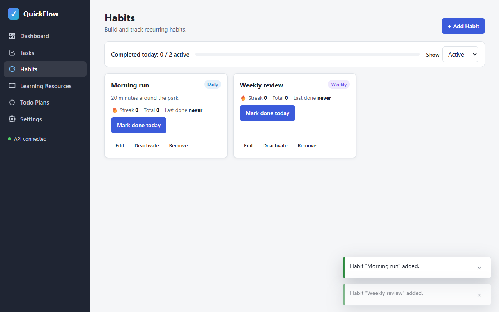
Result: **PASS**

#### C4 Complete for today; no duplicate after reload
| # | Action (MCP tool) | Target / input | Observation |
|---|---|---|---|
| 1 | ↳ click | "Complete Morning run for today" | `POST /api/habits/12/completions => 201` |
| 2 | ↳ evaluate | state | `{"summary":"Completed today: 1 / 2 active","cards":["Morning run \| done=true \| 🔥 Streak 1Total 1Last done Today \| toggle=✓ Done today · Undo", "Weekly review \| done=false \| … \| toggle=Mark done today"]}` |
| 3 | ↳ `page.reload()` + evaluate | state | identical: `"Completed today: 1 / 2 active"`, Morning run done=true, Streak 1, Total 1 |
| 4 | ↳ count | Morning run "complete" buttons | `0` (only Undo offered) |
| 5 | ↳ evaluate `Api.habits.completions(12)` | completions | `["2026-09-24"]` (`GET /api/habits/12/completions => 200`) — exactly one record |

Expected: card done, streak 1, "1 / 2"; still one completion after reload
Actual: as expected
Screenshots: 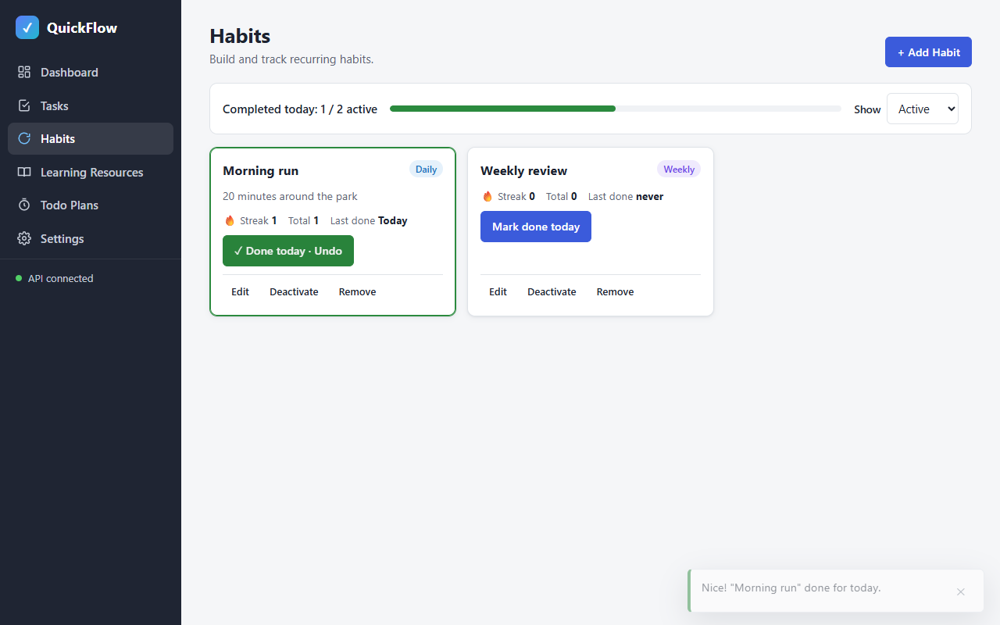 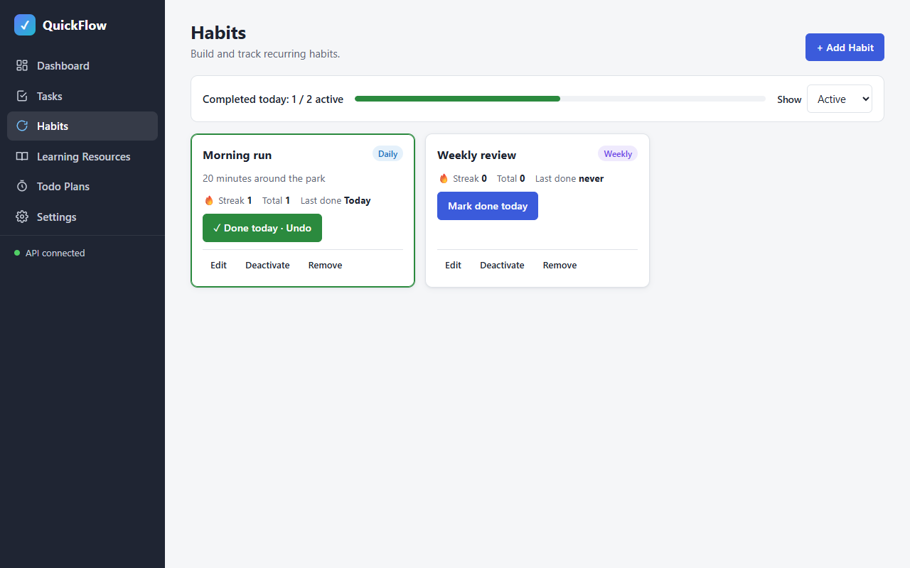
Result: **PASS**

#### C5 Undo today's completion
| # | Action (MCP tool) | Target / input | Observation |
|---|---|---|---|
| 1 | ↳ click | "Undo today's completion of Morning run" | `DELETE /api/habits/12/completions/2026-09-24 => 204` |
| 2 | ↳ evaluate | state | `{"summary":"Completed today: 0 / 2 active","cards":["Morning run \| done=false \| 🔥 Streak 0Total 0Last done never \| toggle=Mark done today", …]}` |

Expected: card back to not done
Actual: as expected
Screenshot: 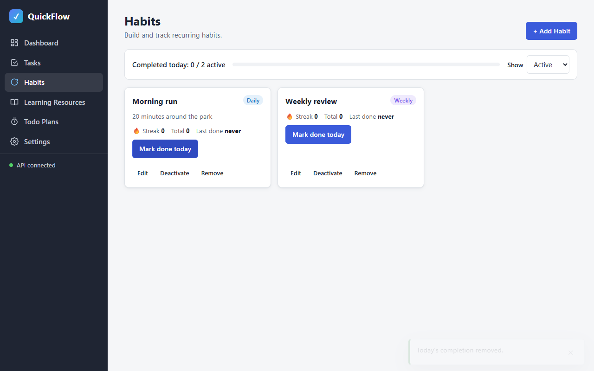
Result: **PASS**

#### C6 Edit name and frequency
| # | Action (MCP tool) | Target / input | Observation |
|---|---|---|---|
| 1 | ↳ click | "Edit Weekly review" | prefilled `{"name":"Weekly review","frequency":"Weekly"}` |
| 2 | ↳ fill + select + click | Name "Evening reading", Frequency Daily → Save changes | `PUT /api/habits/13 => 200` |
| 3 | ↳ evaluate | cards | `["Morning run \| Daily","Evening reading \| Daily"]` |

Expected: card shows new name and frequency
Actual: as expected
Screenshot: 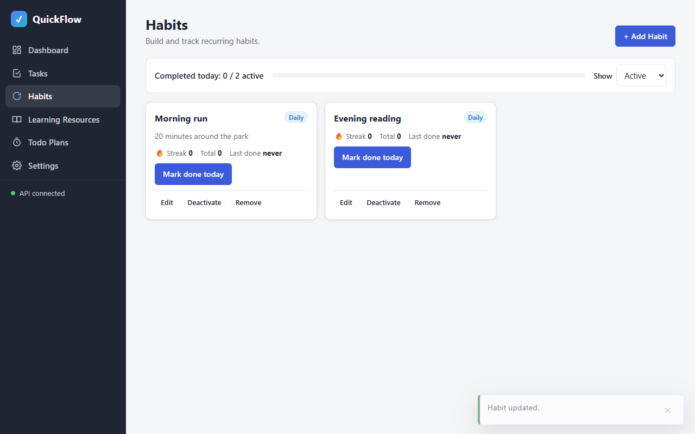
Result: **PASS**

#### C7 Deactivate / activate
| # | Action (MCP tool) | Target / input | Observation |
|---|---|---|---|
| 1 | ↳ click | "Deactivate Evening reading" | `POST /api/habits/13/deactivate => 200` |
| 2 | ↳ evaluate | Active view | `{"cards":["Morning run \| Daily"],"summary":"Completed today: 0 / 1 active"}` |
| 3 | ↳ select Show = Inactive + evaluate | cards | `["Evening reading \| Daily,Inactive"]` |
| 4 | ↳ click | "Activate Evening reading" | `POST /api/habits/13/activate => 200`; inactive view shows "No inactive habits" |
| 5 | ↳ select Show = Active + evaluate | cards | `{"cards":["Morning run \| Daily","Evening reading \| Daily"],"summary":"Completed today: 0 / 2 active"}` |

Expected: Inactive badge, hidden from Active, restored by Activate
Actual: as expected
Screenshots: 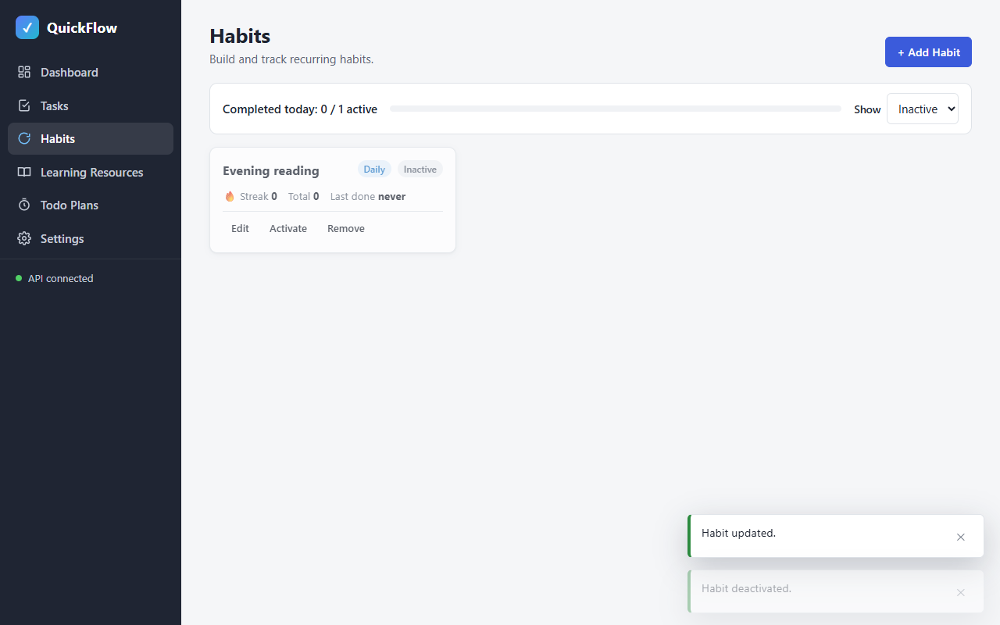 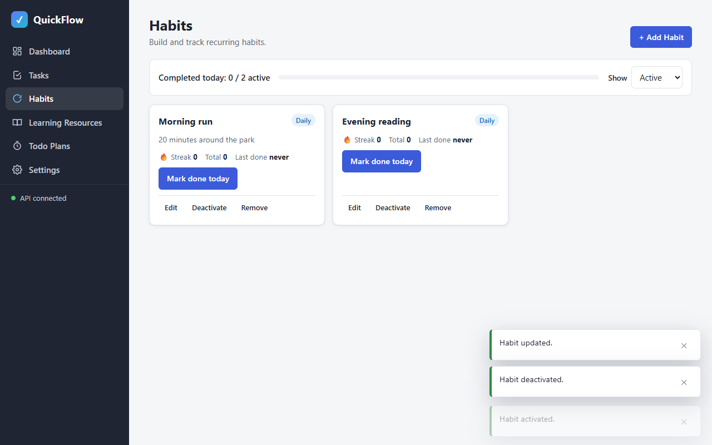
Result: **PASS**

#### C8 [smoke] Remove after confirming
| # | Action (MCP tool) | Target / input | Observation |
|---|---|---|---|
| 1 | ↳ click | "Remove Evening reading" | dialog text `"Remove habit … Remove \"Evening reading\" and its completion history? This cannot be undone. … Cancel Remove"` |
| 2 | ↳ click | "Remove" | `DELETE /api/habits/13 => 204` |
| 3 | ↳ evaluate | cards | `{"cards":["Morning run \| Daily"],"summary":"Completed today: 0 / 1 active"}` |

Expected: card removed
Actual: as expected
Screenshots: 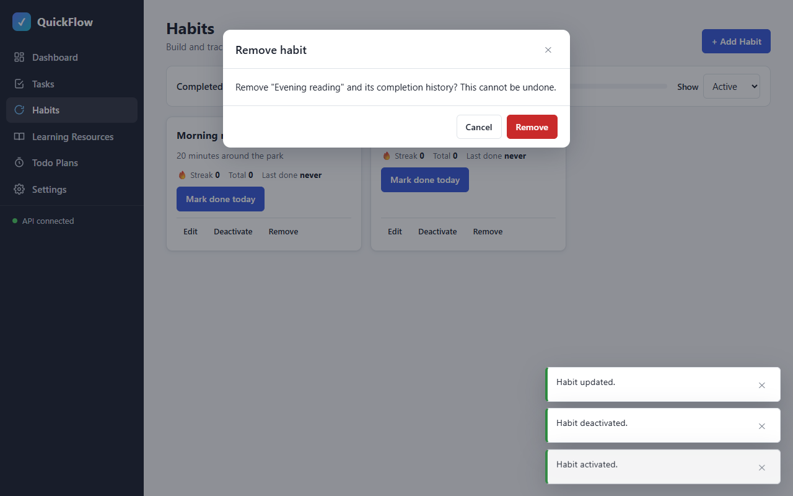 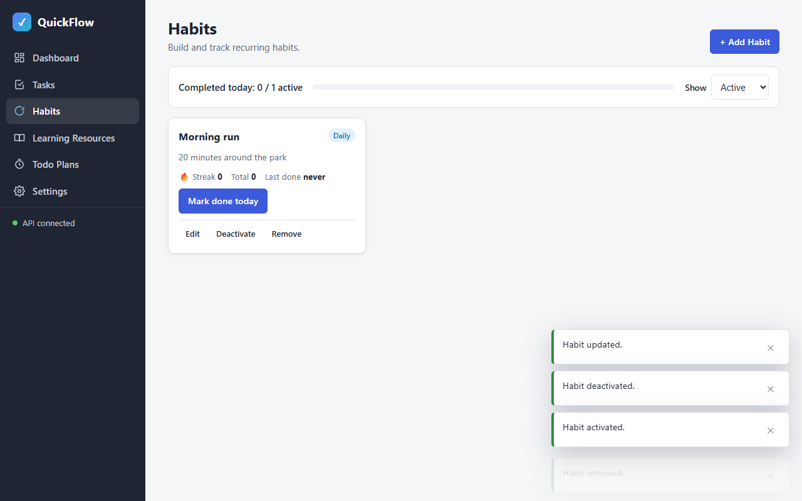
Result: **PASS**

#### Console & network
- Console errors: 0 (`browser_console_messages` level warning, all: `Total messages: 0 (Errors: 0, Warnings: 0)`)
- Failed requests: 0 — `browser_network_requests` saved to file: 44 API requests, `grep -v '=> \[2'` → none

#### Smoke regression
| Check | Result | Observation |
|---|---|---|
| phase-01 C1/C2/C4 ([smoke/phase-01.js](smoke/phase-01.js)) | PASS | `{"C1":{"hash":"#/dashboard","links":[6 links],"h1":"Dashboard"},"C4":"API connected","C2":["#/tasks Tasks active=Tasks",…,"#/dashboard Dashboard active=Dashboard"]}` |
| phase-02 C1/C9 ([smoke/phase-02.js](smoke/phase-02.js)) | PASS | `{"C1":"empty state → dialog \"Add task\"","C9":"created and deleted \"Smoke task 1790262719906\"; rows now: 2"}` |
| phase-03 smoke script self-check ([smoke/phase-03.js](smoke/phase-03.js)) | PASS | `{"C1":"empty state \"No inactive habits\" → dialog \"Add habit\"","C8":"created, completed (🔥 Streak 1), removed \"Smoke habit 1790262723586\""}` |

**Unit tests:** not present (optional)
**Teardown:** `browser_close` → "No open tabs"; frontend stop → port 5500 curl 000; backend left running
**Result:** PASS 8/8

## Unit tests (optional)
- Command: —
- Result: —

## Failure record
—

## Notes
- Test data: 4 leftover backend-loop habits deleted through the API for the empty-state check; everything else created through the UI.
- Quick-add route `#/habits?new=1` uses the same mechanism verified for tasks in phase-02 (T7) and is exercised again by the dashboard quick-add check (phase-06 C7).
- Later-phase regression: [smoke/phase-03.js](smoke/phase-03.js) — C1 via the Inactive filter's empty state (same Add Habit action), C8 via add → complete → remove.
