# phase-04-learning — Learning Resources page

| Field | Value |
|---|---|
| Loop | frontend-dev |
| Status | completed |
| Attempts | 1 / 3 |
| Depends on | phase-01-app-shell |
| Requirements covered | US Learning 1-5, FR-05, FR-06, BR-8, BR-9, §8 Learning Resources Page, §12 AC Learning, NFR Usability |
| Requirements source | docs/Task_PRD.md |
| Started | 2026-09-24T18:13:34+03:00 |
| Ended | 2026-09-24T18:16:21+03:00 |

## Goal
Users can add, edit and remove learning cards in a card grid, expand a card to add/complete/remove milestones
and add/remove notes, and see milestone progress, with a guiding empty state.

## Tasks
<!-- Mark [x] only when the task is implemented AND covered by a passing check. -->
- [x] T1 Card grid: title, description/source, status badge, milestone progress bar (done/total), notes count
- [x] T2 Add/Edit card modal (title required ≤200, description ≤2000, status NotStarted/InProgress/Completed)
- [x] T3 Remove card with confirmation
- [x] T4 Expandable card: milestones with done checkbox (`PATCH`), target date, remove; add-milestone form (title required, optional target date)
- [x] T5 Notes with timestamp and remove; add-note form (text required ≤4000)
- [x] T6 Empty state with "Add Learning Card"; status filter; quick-add route `#/learning?new=1`

## Acceptance checks
- [x] C1 [smoke] With no cards, the page shows the empty state whose "Add Learning Card" button opens the form
- [x] C2 Adding a card shows it in the grid with status "Not started" and "0 / 0 milestones"
- [x] C3 Validation: empty title shows "Title is required." and sends no request
- [x] C4 Expanding a card and adding two milestones (one with a target date) lists both
- [x] C5 Checking one milestone shows it done and progress "1 / 2" (50%)
- [x] C6 Removing a milestone removes it from the list
- [x] C7 Adding a note shows its text and timestamp; removing it removes it
- [x] C8 Editing a card's status (to "Completed") updates its badge
- [x] C9 [smoke] Removing a card (after confirming) removes it from the grid

## Verification

### Attempt 1 — 2026-09-24T18:14:39+03:00
**Backend:** already running (health 200) — not started by loop
**Static server:** PASS (`npx --yes http-server frontend -p 5500 -c-1 --silent` → 200 on first poll)
**Viewport:** 1280x800 (`browser_resize`)
**Test-data setup (curl):** deleted the 3 leftover backend-loop cards (`DELETE /api/learning-cards/{7,3,1}` → 204 each; `GET /api/learning-cards` → `[]`). All cards, milestones and notes in this phase were created through the UI.
**Method:** flows driven with `browser_run_code_unsafe` (real Playwright clicks/fills; `page.on('response')` logs API calls); returned JSON quoted verbatim.

#### C1 [smoke] Empty state with Add Learning Card opens the form
| # | Action (MCP tool) | Target / input | Observation |
|---|---|---|---|
| 1 | browser_run_code_unsafe → goto | `http://localhost:5500/#/learning` | `GET /api/learning-cards => 200` |
| 2 | ↳ evaluate | empty state | `{"h2":"No learning cards yet","text":"Add a course, book or topic you are learning and track it with milestones and notes.","button":"Add Learning Card"}` |
| 3 | ↳ click | "Add Learning Card" | dialog `"Add learning card"` |

Result: **PASS** — Screenshot: 

#### C3 Validation: empty title
| # | Action (MCP tool) | Target / input | Observation |
|---|---|---|---|
| 1 | ↳ click | "Add card" with empty title | `{"error":"Title is required.","dialogOpen":1,"requests":[]}` |

Result: **PASS** — Screenshot: 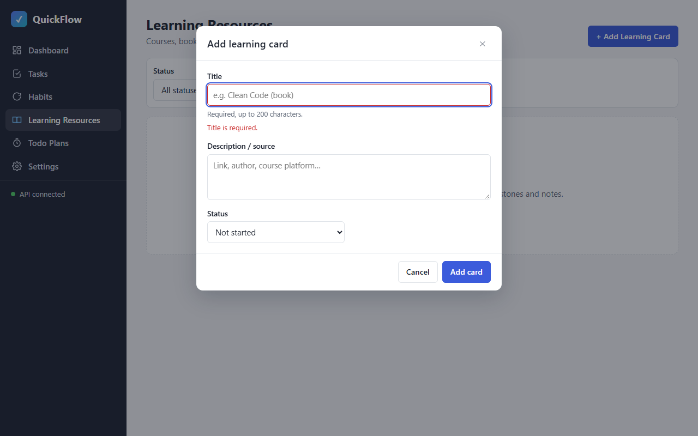

#### C2 Add a card
| # | Action (MCP tool) | Target / input | Observation |
|---|---|---|---|
| 1 | ↳ fill + click | Title "Clean Code", Description / source "Book by Robert C. Martin" → Add card | `POST /api/learning-cards => 201`, `GET /api/learning-cards => 200` |
| 2 | ↳ evaluate | cards | `[{"title":"Clean Code","status":"Not started","milestones":"0 / 0 milestones","pct":"0%","notes":"📝 0 notes","items":[]}]` |

Result: **PASS** — Screenshot: 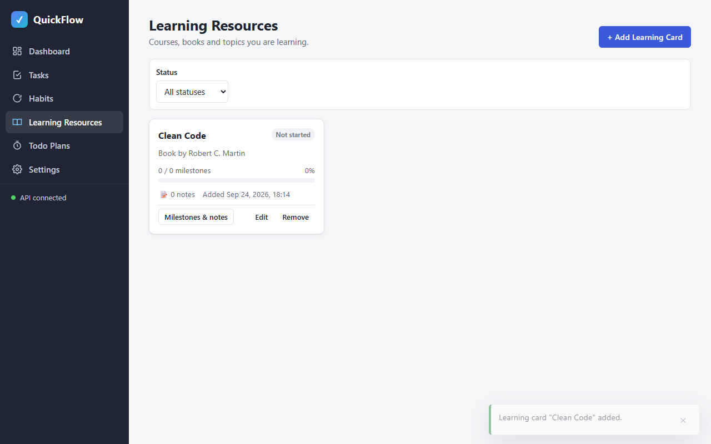

#### C4 Expand and add two milestones (one with a target date)
| # | Action (MCP tool) | Target / input | Observation |
|---|---|---|---|
| 1 | ↳ click | "Show milestones and notes of Clean Code" | details open: `"No milestones yet — break this resource into steps below."` |
| 2 | ↳ fill + click | "Read chapters 1-3", target 2026-09-30 → Add milestone | `POST /api/learning-cards/10/milestones => 201`, `GET /api/learning-cards/10 => 200` |
| 3 | ↳ fill + click | "Refactor a module" → Add milestone | `POST /api/learning-cards/10/milestones => 201` |
| 4 | ↳ evaluate | card | `"milestones":"0 / 2 milestones","pct":"0%","items":["Read chapters 1-3 · target Sep 30, 2026 done=false","Refactor a module done=false"]` |

Result: **PASS** — Screenshot: 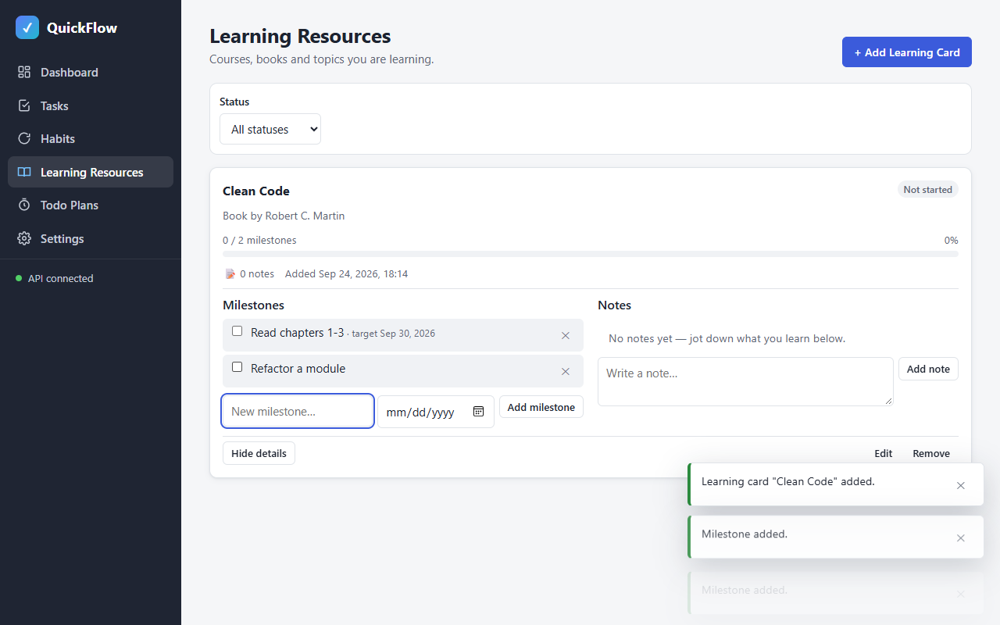

#### C5 Complete one milestone → 1 / 2 (50%)
| # | Action (MCP tool) | Target / input | Observation |
|---|---|---|---|
| 1 | ↳ check | checkbox "Read chapters 1-3" | `PATCH /api/learning-cards/10/milestones/9 => 200` |
| 2 | ↳ evaluate | card | `{"status":"In progress","milestones":"1 / 2 milestones","pct":"50%","items":["Read chapters 1-3 · target Sep 30, 2026 · done Sep 24, 2026, 18:14 done=true","Refactor a module done=false"]}` |

Result: **PASS** — Screenshot: 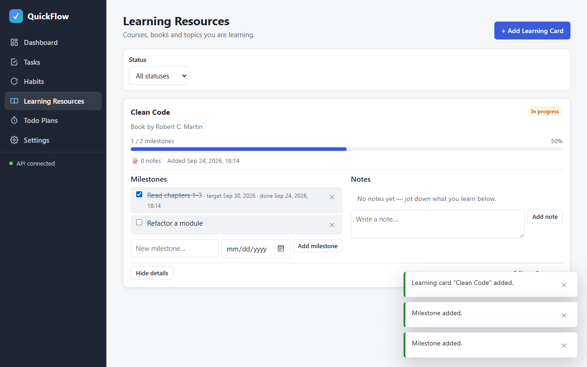

#### C6 Remove a milestone
| # | Action (MCP tool) | Target / input | Observation |
|---|---|---|---|
| 1 | ↳ click | "Remove milestone Refactor a module" | `DELETE /api/learning-cards/10/milestones/10 => 204` |
| 2 | ↳ evaluate | card | `"Clean Code \| In progress \| 1 / 1 milestones 100% \| 📝 0 notes \| milestones=[\"Read chapters 1-3\"]"` |

Result: **PASS** — Screenshot: 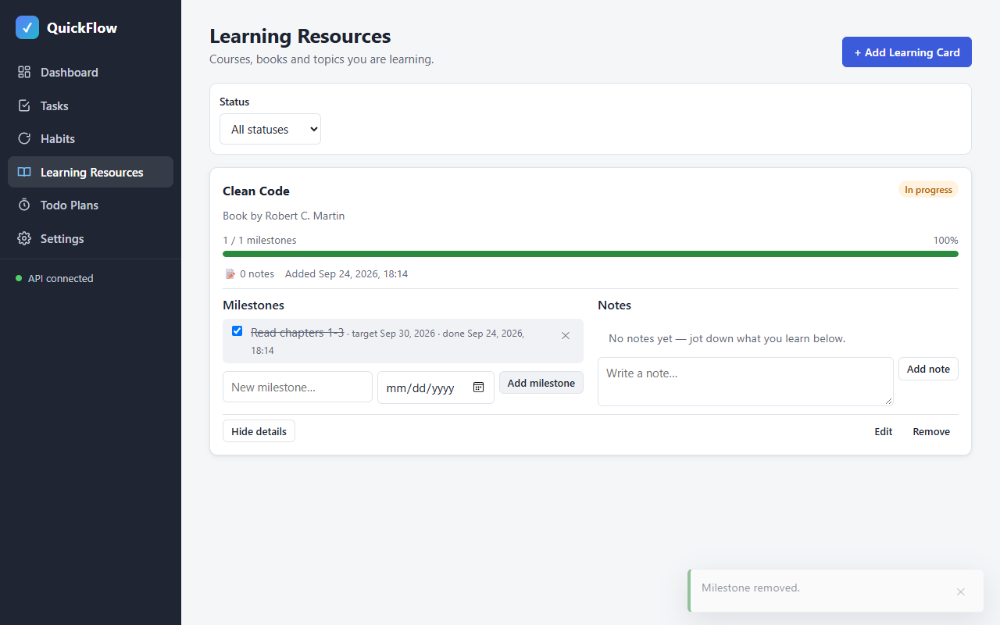

#### C7 Add a note (text + timestamp), then remove it
| # | Action (MCP tool) | Target / input | Observation |
|---|---|---|---|
| 1 | ↳ fill + click | note "Functions should do one thing." → Add note | `POST /api/learning-cards/10/notes => 201` |
| 2 | ↳ evaluate | card | `"📝 1 note \| notes=[\"Functions should do one thing. @ Sep 24, 2026, 18:15\"]"` |
| 3 | ↳ click | "Remove note Functions should do one thing." | `DELETE /api/learning-cards/10/notes/3 => 204` |
| 4 | ↳ evaluate | card | `"📝 0 notes \| … \| notes=[]"` |

Result: **PASS** — Screenshots: 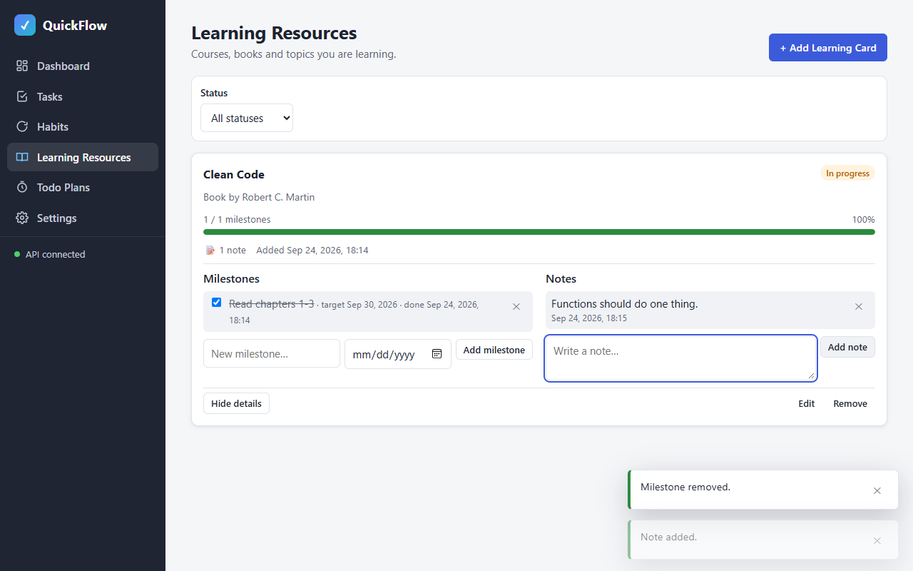 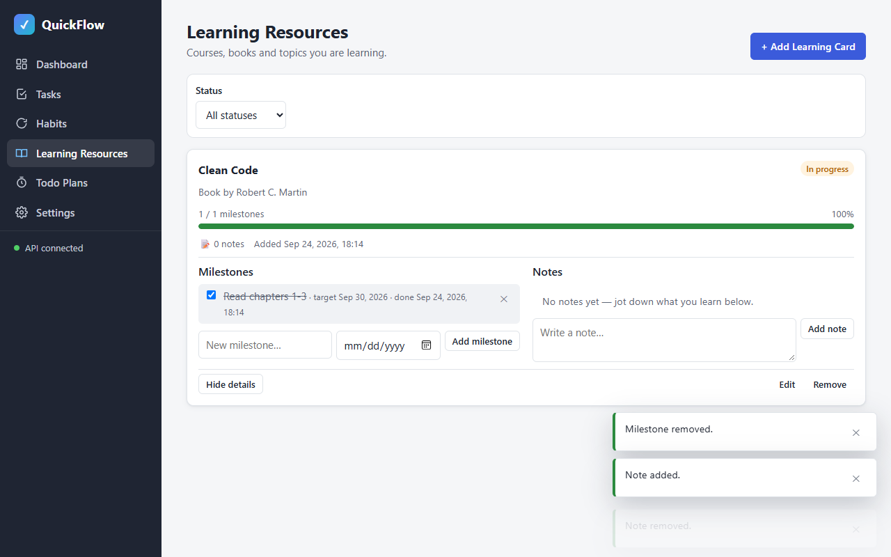

#### C8 Edit status → badge updates
| # | Action (MCP tool) | Target / input | Observation |
|---|---|---|---|
| 1 | ↳ click | "Edit Clean Code" | prefill `{"title":"Clean Code","status":"InProgress"}` |
| 2 | ↳ select + click | Status = Completed → Save changes | `PUT /api/learning-cards/10 => 200` |
| 3 | ↳ evaluate | card | `"Clean Code \| Completed \| 1 / 1 milestones 100% \| …"` |

Result: **PASS** — Screenshot: 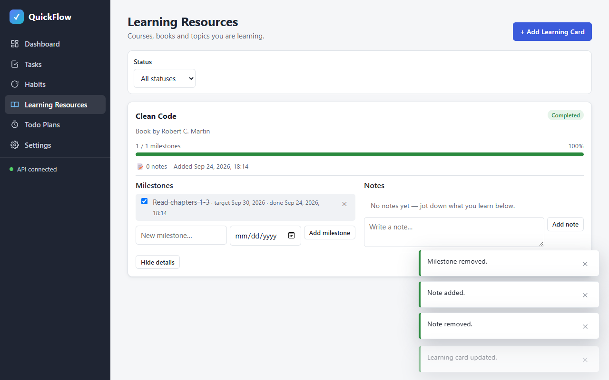

#### C9 [smoke] Remove a card after confirming
| # | Action (MCP tool) | Target / input | Observation |
|---|---|---|---|
| 1 | ↳ click | "Remove Clean Code" | dialog `"Remove learning card … Remove \"Clean Code\" with its milestones and notes? This cannot be undone. … Cancel Remove"` |
| 2 | ↳ click | "Remove" | `DELETE /api/learning-cards/10 => 204` |
| 3 | ↳ evaluate | grid | `{"cards":0,"empty":"No learning cards yet"}` |

Result: **PASS** — Screenshots: 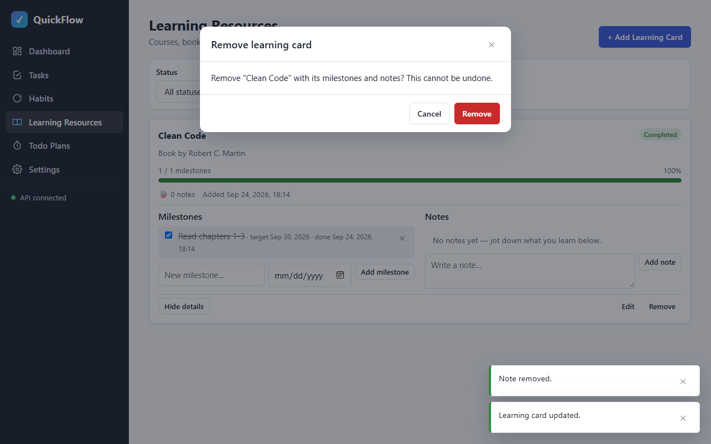 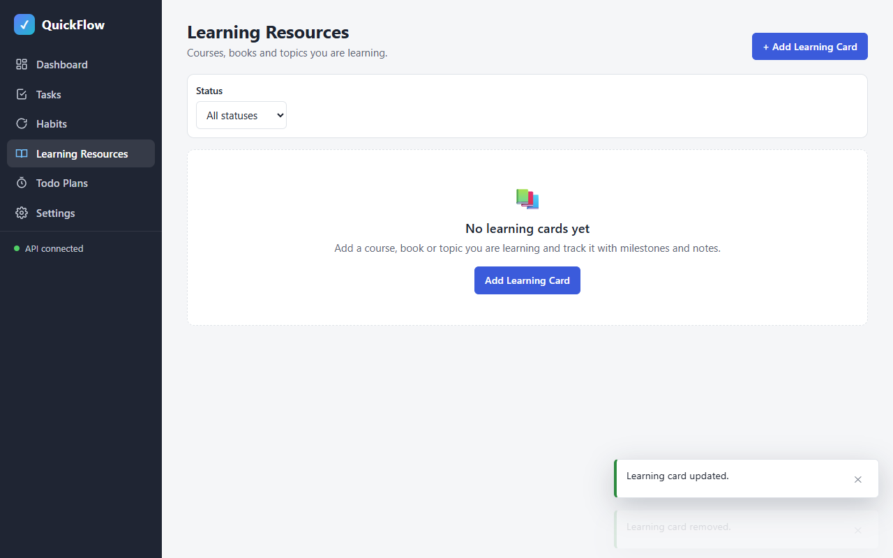

#### Console & network
- Console errors: 0 (`Total messages: 0 (Errors: 0, Warnings: 0)`)
- Failed requests: 0 — 50 API requests saved via `browser_network_requests`, `grep -v '=> \[2'` → none

#### Smoke regression
| Check | Result | Observation |
|---|---|---|
| phase-01 C1/C2/C4 | PASS | `{"C1":{"hash":"#/dashboard","links":[6],"h1":"Dashboard"},"C4":"API connected","C2":[6 routes, each active]}` |
| phase-02 C1/C9 | PASS | `{"C1":"empty state → dialog \"Add task\"","C9":"created and deleted \"Smoke task 1790262952371\"; rows now: 2"}` |
| phase-03 C1/C8 | PASS | `{"C1":"empty state \"No inactive habits\" → dialog \"Add habit\"","C8":"created, completed (🔥 Streak 1), removed \"Smoke habit 1790262956518\""}` |
| phase-04 script self-check | PASS | `{"C1":"filter \"All\": \"No learning cards yet\" → dialog \"Add learning card\"","C9":"created (0 / 1 milestones), removed \"Smoke card 1790262959570\""}` |

Screenshot: 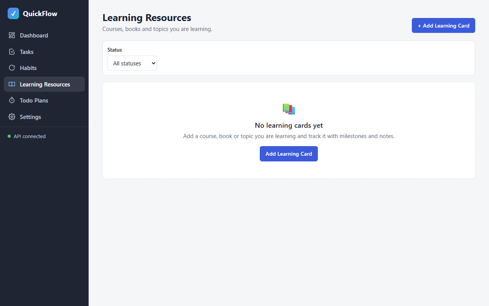

**Unit tests:** not present (optional)
**Teardown:** `browser_close` → "No open tabs"; frontend stop → port 5500 curl 000; backend left running
**Result:** PASS 9/9

## Unit tests (optional)
- Command: —
- Result: —

## Failure record
—

## Notes
- Test data: 3 leftover backend-loop learning cards deleted through the API for the empty-state check.
- C8 was reworded before it was verified: the backend moves a card to "In progress" when one of its milestones is completed (seen in C5), so the edit is verified with "Completed".
- Later-phase regression: [smoke/phase-04.js](smoke/phase-04.js) — C1 via the first status filter that shows an empty state, C9 via add → milestone → remove.
