# phase-05-todo-plans — Todo Plans page

| Field | Value |
|---|---|
| Loop | frontend-dev |
| Status | completed |
| Attempts | 2 / 3 |
| Depends on | phase-02-tasks, phase-03-habits, phase-04-learning |
| Requirements covered | US Todo Plans 1-10, FR-07, FR-08, BR-10..13, §8 Todo Plans Page, §12 AC Todo Plans, NFR Performance (rest time ≥ 1/min), NFR Reliability |
| Requirements source | docs/Task_PRD.md |
| Started | 2026-09-24T18:17:53+03:00 |
| Ended | 2026-09-24T18:31:23+03:00 |

## Goal
Users build plans from existing tasks, habits and learning cards with estimated duration, start/end date-time and
priority order; see active/upcoming and completed plans with progress and a live rest-time countdown; toggle items
done; edit and remove plans; get an in-app notification when a plan's start time is reached; and see plan history.

## Tasks
<!-- Mark [x] only when the task is implemented AND covered by a passing check. -->
- [x] T1 Plans page: "Active & upcoming" list ordered by priority order, "Completed / history" list from `GET /api/plans/history`
- [x] T2 Plan builder modal: title, estimated duration (h + min), start/end date-time, priority order, pickers for existing tasks, habits and learning cards; validation (title required ≤200, duration > 0, end after start, priority ≥ 0, ≥ 1 item)
- [x] T3 Plan card: status badge, progress bar (done/total, %), live rest time (ticks every second, re-synced from the server at least every 60 s) only between start and end, "Starts in …" before start, time-elapsed bar
- [x] T4 Per-item done toggles (`PATCH /api/plans/{id}/items/{itemId}`) updating progress immediately
- [x] T5 Edit plan (`PUT`), remove plan with confirmation
- [x] T6 Global start notifier: polls `GET /api/plans/notifications`, shows a toast and highlights the plan card, acknowledges on dismiss (`POST …/notifications/ack`)
- [x] T7 Empty state with "Create Plan"; quick-add route `#/plans?new=1`
- [x] T8 Pure helpers in `frontend/js/lib/plan-time.js` (rest-time formatting and countdown) with browser tests in `frontend/tests/plan-time.test.html`

## Acceptance checks
- [x] C1 [smoke] With no plans, the page shows the empty state whose "Create Plan" button opens the builder
- [x] C2 The builder lists existing tasks, habits and learning cards; submitting with no items or with end before start shows errors and sends no request
- [x] C3 Creating an in-progress plan with 3 items (task, habit, card) shows it under "Active & upcoming" with "0%" and a rest time
- [x] C4 The rest time counts down: two readings ≥ 5 s apart, the second smaller
- [x] C5 [smoke] Toggling one item done shows "33%" immediately; the referenced task shows "Done" on the Tasks page (BR-13)
- [x] C6 A plan starting ~1 min ahead shows "Starts in …"; when the start is reached a notification toast appears and the card shows a rest time
- [x] C7 Dismissing the notification acknowledges it (`POST …/ack` → 200); it does not reappear after reload
- [x] C8 Marking every item done moves the plan to "Completed" history with "100%"
- [x] C9 Editing a plan's priority order reorders the list; removing a plan (after confirming) removes it
- [x] C10 `frontend/tests/plan-time.test.html` reports all tests passing

## Verification

### Attempt 1 — 2026-09-24T18:20:45+03:00
**Backend:** already running (health 200) — not started by loop
**Static server:** PASS (`npx --yes http-server frontend -p 5500 -c-1 --silent` → 200 on first poll)
**Viewport:** 1280x800 (`browser_resize`)
**Test-data setup (curl):** deleted the 3 leftover backend-loop plans (`DELETE /api/plans/{1,3,5}` → 204; `GET /api/plans` → `[]`); seeded plan sources `POST /api/tasks` "Prepare slides" (id 28) → 201 and `POST /api/learning-cards` "Clean Architecture" (id 12) → 201 (habit "Morning run" id 12 existed from phase-03). For C9 seeded a second active plan "Deep work" (id 9, priority 5) → 201 and acknowledged its start (`POST /api/plans/9/notifications/ack` → 200) so its toast would not interfere.
**Method:** flows driven with `browser_run_code_unsafe` (real Playwright clicks/fills; `page.on('response')` logs API calls); returned JSON quoted verbatim.

#### C1 [smoke] Empty state with Create Plan
| # | Action | Observation |
|---|---|---|
| 1 | goto `#/plans` + evaluate | `{"h2":"No plans yet","text":"Build a time-boxed plan from your existing tasks, habits and learning resources.","button":"Create Plan","historyHidden":true}` |
| 2 | click "Create Plan" | dialog `"Create plan"` |

Result: **PASS** — 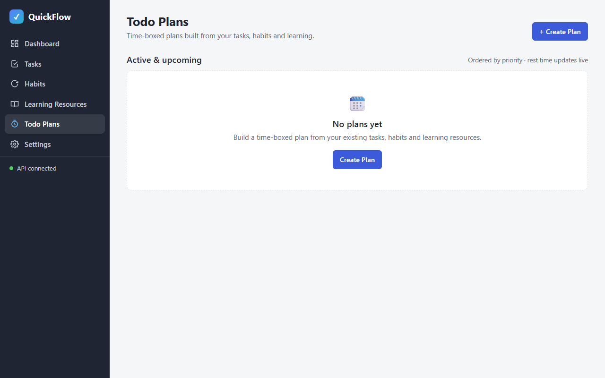

#### C2 Builder lists sources; validation blocks bad input
| # | Action | Observation |
|---|---|---|
| 1 | evaluate pickers | `["Tasks: Call the bank due Today / Prepare slides due Today / Write quarterly report (done)","Habits: Morning run Daily","Learning resources: Clean Architecture Not started"]` |
| 2 | Title "Focus block", no items → Create plan | `["Select at least one task, habit or learning resource."]` |
| 3 | end = start − 1 h, check "Prepare slides" → Create plan | `["End must be after the start."]` |
| 4 | response log during both invalid submits | `[]` |

Result: **PASS** — 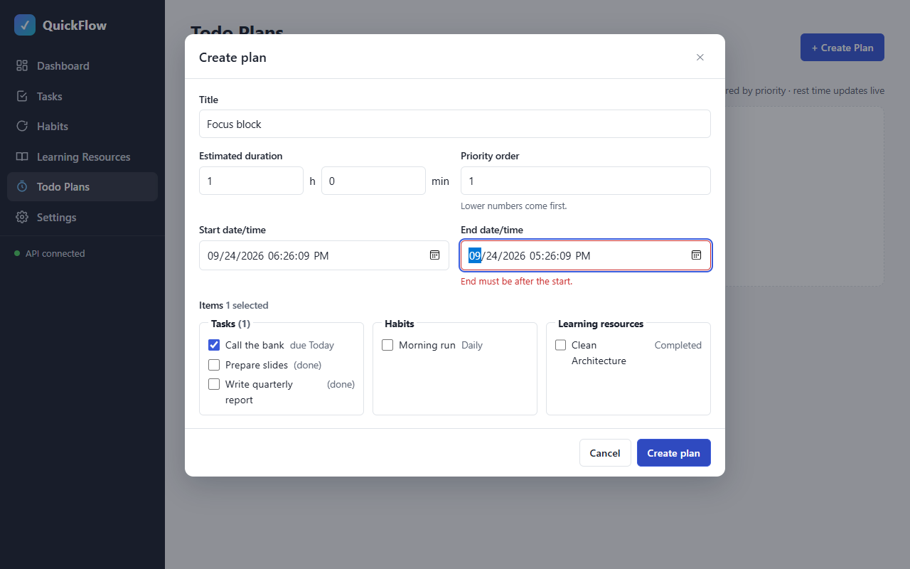

#### C3 Create an in-progress plan with a task, a habit and a card
| # | Action | Observation |
|---|---|---|
| 1 | start = now − 1 min, end = now + 30 min, 0 h 30 min, check Morning run + Clean Architecture | `"3 selected"` |
| 2 | Create plan | `POST /api/plans => 201`, then `GET /api/plans`, `GET /api/plans/history` 200 |
| 3 | evaluate card | `{"section":"Active & upcoming","status":"In progress","pct":"0%","progress":"0 / 3 items done","rest":"00:30:00","restSeconds":1800,"items":["Task Prepare slides","Habit Morning run","Learning Clean Architecture"],"stats":"🗓 Sep 24, 2026, 18:20 → 18:51⏱ Est. 30 min"}` |

Result: **PASS** —  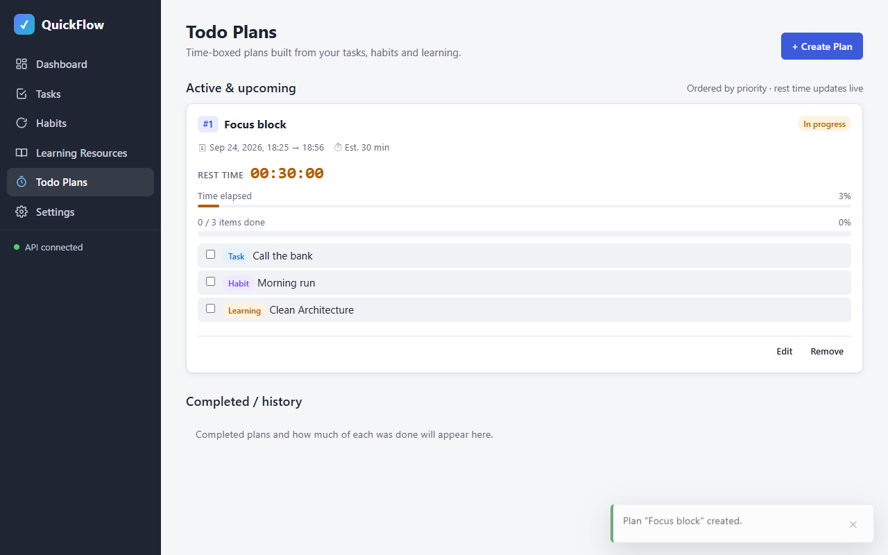

#### C4 Rest time counts down (two readings ≥ 5 s apart)
| Reading | Time (UTC) | Rest time |
|---|---|---|
| 1 | 2026-09-24T15:21:06.474Z | `00:30:00` (1800 s) |
| 2 | 2026-09-24T15:21:12.534Z | `00:29:55` (1795 s) |

Decrease: 5 s over 6.06 s. Result: **PASS** — 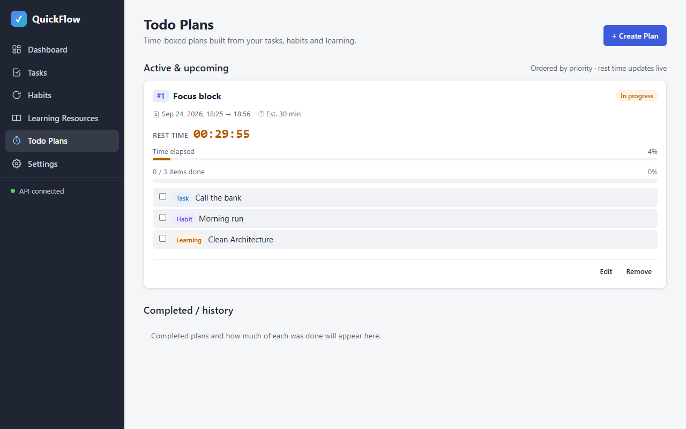

#### C5 [smoke] Toggle one item → 33%; task Done on Tasks page (BR-13)
| # | Action | Observation |
|---|---|---|
| 1 | check "Prepare slides" | `PATCH /api/plans/7/items/16 => 200`; UI updated in 127 ms |
| 2 | evaluate card | `{"pct":"33%","progress":"1 / 3 items done","items":["Task Prepare slides done=true","Habit Morning run done=false","Learning Clean Architecture done=false"],"status":"In progress"}` |
| 3 | click nav "Tasks" + evaluate row | `"Prepare slides \| Done,High priority"` |

Result: **PASS** — 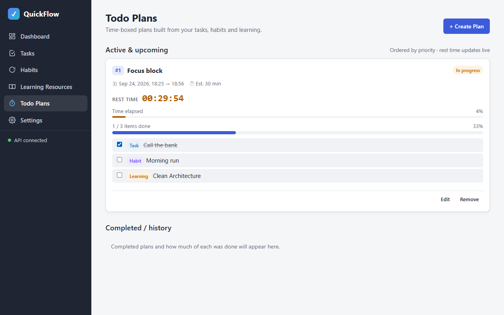 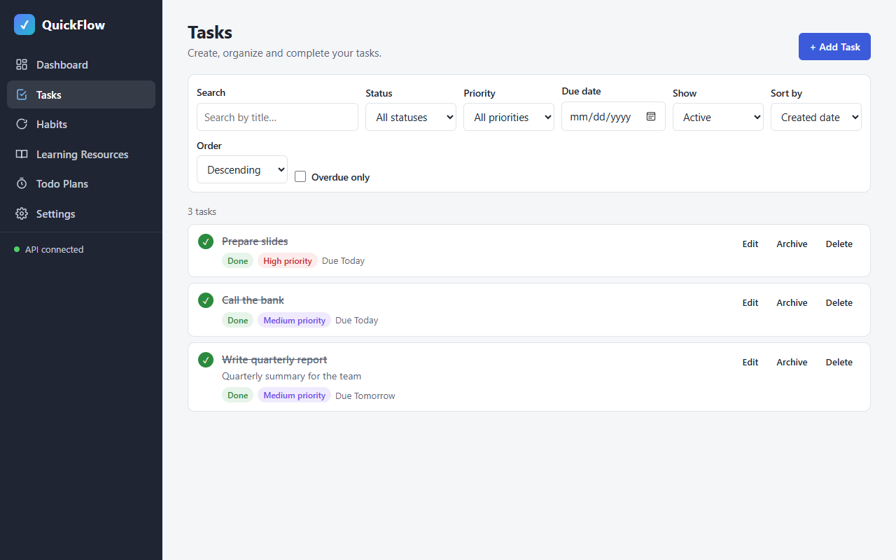

#### C6 Upcoming plan → start notification → rest time
| # | Action | Observation |
|---|---|---|
| 1 | (Focus block had started before creation; its toast `"⏰ Plan started \"Focus block\" has started — 29 min 51 s left. View plan Dismiss"` was shown and dismissed → `POST /api/plans/7/notifications/ack => 200`) | — |
| 2 | Create plan "Review notes", start = now + 50 s (2026-09-24T15:22:43Z), end + 20 min, item "Call the bank" | `POST /api/plans => 201` |
| 3 | two readings | `{"status":"Not started","startsIn":"50 s"}` @15:21:53 → `{"startsIn":"47 s"}` @15:21:56 |
| 4 | wait for toast | appeared 2026-09-24T15:22:46Z: `"⏰ Plan started\n\"Review notes\" has started — 19 min 58 s left.\nView plan\nDismiss"` |
| 5 | evaluate card | `{"status":"In progress","highlighted":true,"badges":["⏰ Started","In progress"],"rest":"00:19:58","startsIn":null}` |

Result: **PASS** — 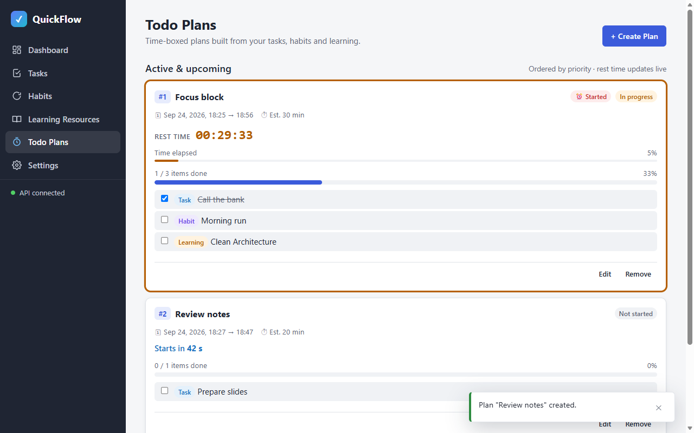 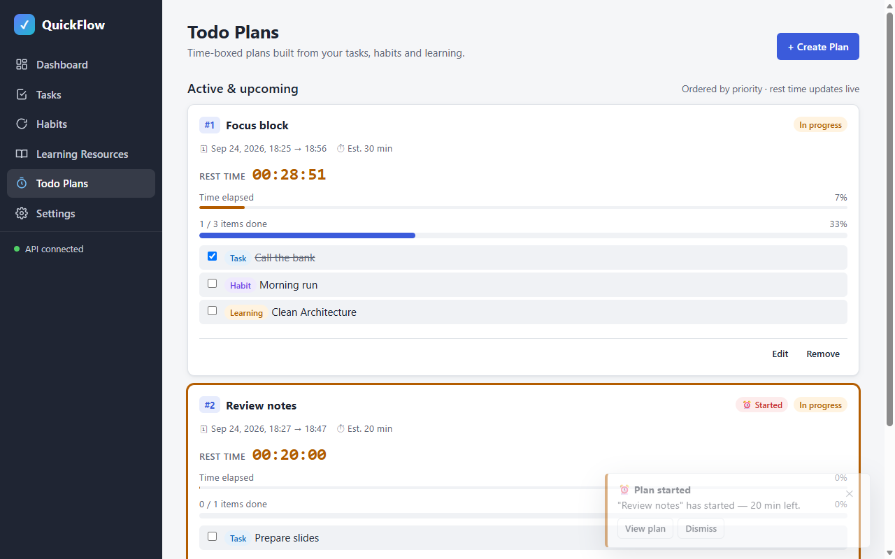

#### C7 Dismiss acknowledges; not shown after reload
| # | Action | Observation |
|---|---|---|
| 1 | click toast "Dismiss" | `POST /api/plans/8/notifications/ack => 200 @15:23:02` |
| 2 | reload, wait 12 s (polls 200 @15:23:12, 15:23:14) | toasts `[]` |
| 3 | evaluate API | notifications `[]`; `startNotifiedAt` `["2026-09-24T15:23:02.0468144Z"]` |

Result: **PASS** — 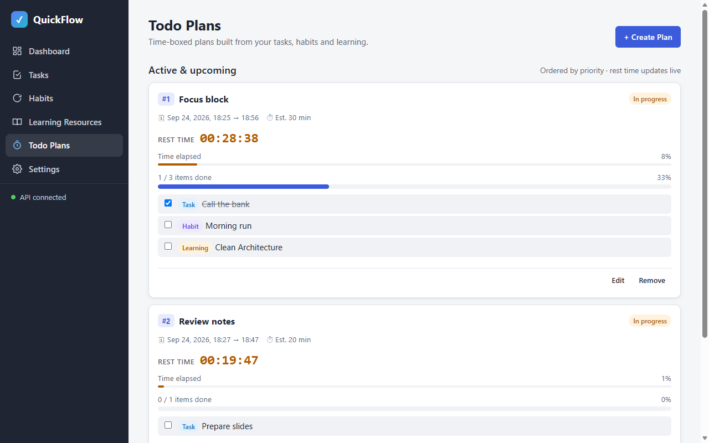

#### C8 All items done → Completed history 100%
| # | Action | Observation |
|---|---|---|
| 1 | check "Morning run" | `PATCH /api/plans/7/items/17 => 200`; `"2 / 3 items done 67%"` |
| 2 | check "Clean Architecture" | `PATCH /api/plans/7/items/18 => 200`; toast `"🎉 Plan \"Focus block\" completed!"` |
| 3 | evaluate | active count 0; history `{"status":"Completed","progress":"3 / 3 items done","pct":"100%","stats":"… All items done"}`; API history `["Focus block 100% Completed"]` |

Result: **PASS** — 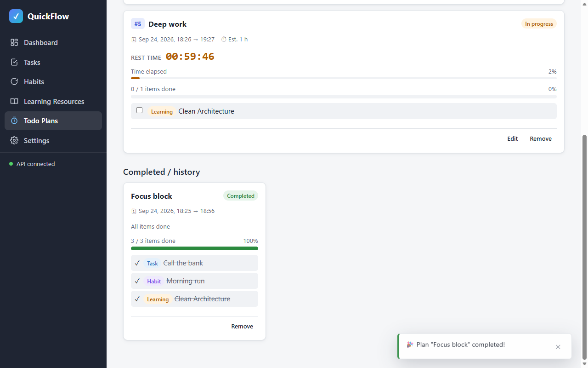

#### C9 Priority reorder; remove plan
| # | Action | Observation |
|---|---|---|
| 1 | reload, evaluate order | `["#2 Review notes","#5 Deep work"]` |
| 2 | Edit Deep work (prefill `{"priority":"5","hours":"1","minutes":"0","checked":["LearningResource:12"]}`), priority 1 → Save | `PUT /api/plans/9 => 200`; order `["#1 Deep work","#2 Review notes"]` |
| 3 | Remove Deep work → confirm | dialog `"Remove the plan \"Deep work\"? Its tasks, habits and learning resources are kept."`; `DELETE /api/plans/9 => 204`; order `["#2 Review notes"]` |

Result: **PASS** — 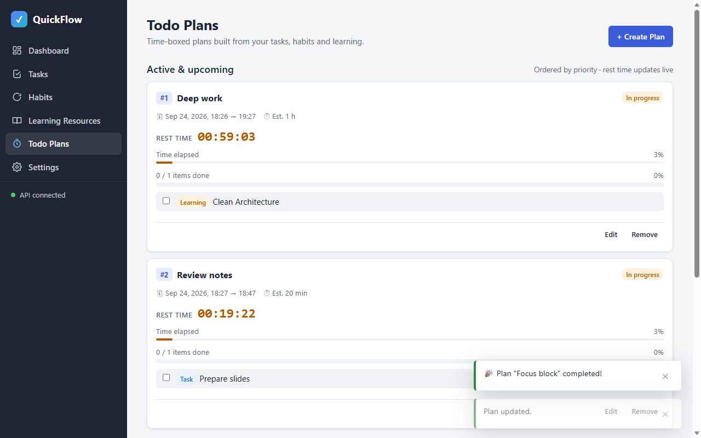 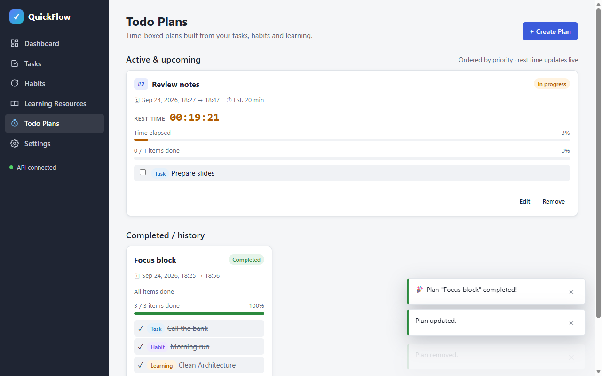

#### C10 Unit test page
| # | Action | Observation |
|---|---|---|
| 1 | browser_navigate `http://localhost:5500/tests/plan-time.test.html` | page loaded; **Console: 1 errors** |
| 2 | browser_evaluate | `{"summary":"26 passed, 0 failed","results":{"passed":26,"failed":0},"failures":[]}` |

Tests: PASS — 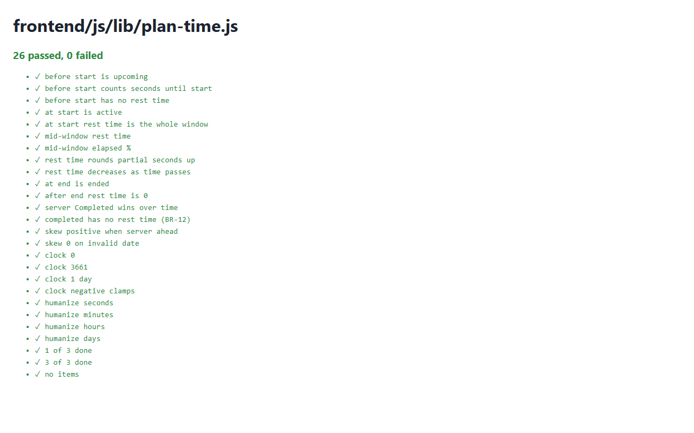

#### Console & network
- **Console errors: 1** — `[ERROR] Failed to load resource: the server responded with a status of 404 (Not Found) @ http://localhost:5500/favicon.ico:0` (the test page has no `<link rel="icon">`, so the browser requested the default favicon)
- Failed API requests: 0

**Result:** FAIL 9/10 checks + console error → attempt fails under `fail_on_console_errors: true`
**Fix for attempt 2:** add an inline icon link to `frontend/tests/plan-time.test.html`; re-run all checks.

### Attempt 2 — 2026-09-24T18:25:47+03:00
**Change since attempt 1:** `frontend/tests/plan-time.test.html` gets an inline `<link rel="icon">` (no more `/favicon.ico` request).
**Backend:** already running (health 200) — not started by loop
**Static server:** restarted — stop → `npx --yes http-server frontend -p 5500 -c-1 --silent` → 200 in 1 s
**Browser:** `browser_close` + fresh page (clean console log), `browser_resize` 1280x800
**Test-data setup (curl):** deleted attempt-1 plans (`DELETE /api/plans/7`, `/8` → 204; `GET /api/plans` → `[]`). Sources: tasks "Call the bank" (InProgress), "Prepare slides" (Done), "Write quarterly report" (Done); habit "Morning run"; card "Clean Architecture". For C9 seeded "Deep work" (id 12, priority 5) → 201 and acknowledged (`POST /api/plans/12/notifications/ack` → 200).

| Check | Action (browser_run_code_unsafe: real clicks/fills) | Observation (verbatim) | Result |
|---|---|---|---|
| C1 [smoke] | goto `#/plans`; click empty-state "Create Plan" | `{"h2":"No plans yet","button":"Create Plan","historyHidden":true}` → dialog `"Create plan"` | **PASS** |
| C2 | read pickers; submit without items; end = start − 1 h | pickers `["Tasks: Call the bank due Today / Prepare slides (done) / Write quarterly report (done)","Habits: Morning run Daily","Learning resources: Clean Architecture Completed"]`; `["Select at least one task, habit or learning resource."]`; `["End must be after the start."]`; requests during invalid submits `[]` | **PASS** |
| C3 | "Focus block", start now − 1 min, end + 30 min, 0 h 30 min, items Call the bank + Morning run + Clean Architecture → Create plan | `"3 selected"`; `POST /api/plans => 201`; card `{"section":"Active & upcoming","status":"In progress","pct":"0%","progress":"0 / 3 items done","rest":"00:30:00","restSeconds":1800}` | **PASS** |
| C4 | two readings 6 s apart | `"00:30:00 @2026-09-24T15:26:10.361Z"` → `"00:29:55 @2026-09-24T15:26:16.430Z"`, decreased by 5 s | **PASS** |
| C5 [smoke] | check "Call the bank"; nav Tasks | `PATCH /api/plans/10/items/21 => 200`, UI in 59 ms: `"pct":"33%","progress":"1 / 3 items done"`; Tasks row `"Call the bank \| Done,Medium priority"` (BR-13) | **PASS** |
| C6 | "Review notes" start = 15:27:19Z (now + 45 s), item Prepare slides; wait | `{"status":"Not started","startsIn":"44 s"}` @15:26:35 → `"42 s"` @15:26:38; toast @15:27:19.694Z `"⏰ Plan started\n\"Review notes\" has started — 20 min left.\nView plan\nDismiss"`; card `{"status":"In progress","highlighted":true,"badges":["⏰ Started","In progress"],"rest":"00:20:00"}` | **PASS** |
| C7 | toast Dismiss; reload; wait 12 s | `POST /api/plans/11/notifications/ack => 200 @15:27:19`; polls 200 @15:27:20/30/32; toasts `[]`; notifications API `[]`; `startNotifiedAt` `["2026-09-24T15:27:19.9181158Z"]` | **PASS** |
| C8 | check Morning run, Clean Architecture on Focus block | `PATCH …/items/22 => 200` → `"2 / 3 items done 67%"`; `PATCH …/items/23 => 200`; toast `"🎉 Plan \"Focus block\" completed!"`; active count 0; history `{"status":"Completed","progress":"3 / 3 items done","pct":"100%","stats":"… All items done"}` | **PASS** |
| C9 | Edit Deep work priority 5 → 1; Remove → confirm | order `["#2 Review notes","#5 Deep work"]` → `PUT /api/plans/12 => 200` → `["#1 Deep work","#2 Review notes"]`; `DELETE /api/plans/12 => 204` → `["#2 Review notes"]` | **PASS** |
| C10 | browser_navigate `/tests/plan-time.test.html` + browser_evaluate | `{"summary":"26 passed, 0 failed","results":{"passed":26,"failed":0},"failures":[]}`; no console entry on load | **PASS** |

Screenshots (overwritten by attempt 2):              

#### Fix during attempt 2 (found by the new smoke script) and re-verification
The first run of [smoke/phase-05.js](smoke/phase-05.js) timed out in the script itself (its toast locator also matched the "Plan … created." toast, which has no Dismiss button). Investigating it showed a real edge case: a start toast still showing for a plan that was just **removed** would, on dismiss, `POST …/ack` for a deleted plan (404). Fix: `Notifier.forget(planId)` closes that toast without acknowledging, called after a successful remove in `plans.js`. After `page.reload()` (so the edited scripts are loaded — `notifierHasForget: "function"`, `plansJsCallsForget: true`), the affected behaviour was re-checked:

| Re-check | Observation | Result |
|---|---|---|
| C7 ack path on new code (seeded unacknowledged started plan "Ack recheck 2", id 16) | toast `"⏰ Plan started\n\"Ack recheck 2\" has started — 29 min 57 s left."` → Dismiss → `POST /api/plans/16/notifications/ack => 200`; notifications API `[]`; toasts `[]` | **PASS** |
| C1 + C5 + remove-with-toast (fixed smoke script) | `{"C1":"builder \"Create plan\" with 5 selectable sources","C5":"created \"Smoke plan 1790263859649\", start toast shown, item toggled → 50%, rest time 01:00:00 → 00:59:58, removed (start toast closed)"}` | **PASS** |

(Re-check helper plans "Ack recheck" id 14 and "Ack recheck 2" id 16 were deleted afterwards via curl → 204.)

#### Console & network
- Console errors: 0 — `browser_console_messages` (all, since the fresh page): `Total messages: 0 (Errors: 0, Warnings: 0)`, checked after C10 and again at teardown
- Failed requests: 0 — 112 requests since the last reload saved via `browser_network_requests`, `grep -v '=> \[2'` → none; all logged API calls in the checks above are 2xx

#### Smoke regression
| Check | Result | Observation |
|---|---|---|
| phase-01 C1/C2/C4 | PASS | `{"C1":{"hash":"#/dashboard","links":[6],"h1":"Dashboard"},"C4":"API connected","C2":[6 routes, each active]}` |
| phase-02 C1/C9 | PASS | `{"C1":"empty state → dialog \"Add task\"","C9":"created and deleted \"Smoke task 1790263712102\"; rows now: 3"}` |
| phase-03 C1/C8 | PASS | `{"C1":"empty state \"No inactive habits\" → dialog \"Add habit\"","C8":"created, completed (🔥 Streak 1), removed \"Smoke habit 1790263715879\""}` |
| phase-04 C1/C9 | PASS | `{"C1":"filter \"NotStarted\": \"No not started cards\" → dialog \"Add learning card\"","C9":"created (0 / 1 milestones), removed \"Smoke card 1790263719022\""}` |
| phase-05 C1/C5 (new script) | PASS | see re-check table above |

**Unit tests:** `frontend/tests/plan-time.test.html` — 26 passed, 0 failed
**Teardown:** `browser_close` → "No open tabs"; frontend stop → port 5500 curl 000; backend left running
**Result:** PASS 10/10

## Unit tests (optional)
- Command: open `http://localhost:5500/tests/plan-time.test.html` (browser_navigate + browser_evaluate `window.TEST_RESULTS`)
- Result: 26 passed, 0 failed (attempts 1 and 2)

## Failure record
—

## Notes
- Attempt 1 failed only on a console error (`/favicon.ico` 404 from the standalone test page); behaviour checks were fine. Fixed with an inline icon link.
- Attempt 2 also fixed an edge case found by the smoke script: a removed plan's start toast no longer acknowledges a deleted plan (`Notifier.forget`).
- Test data: 3 leftover backend-loop plans deleted via API; one task and one learning card seeded via API as plan sources; "Deep work" seeded via API (and acknowledged) for the reorder check.
- The notifier polls every 10 s, so the start toast appears within ≤ 10 s of the start (observed 0.7–3 s).
- Later-phase regression: [smoke/phase-05.js](smoke/phase-05.js) (C1 builder, C5 toggle → 50% with live rest time, remove closes start toast).
