# phase-06-dashboard — Dashboard

| Field | Value |
|---|---|
| Loop | frontend-dev |
| Status | completed |
| Attempts | 2 / 3 |
| Depends on | phase-05-todo-plans |
| Requirements covered | US Dashboard 1-6, FR-08 (dashboard roll-up), FR-09, §8 Dashboard, §11 E2E flow, §12 AC Dashboard |
| Requirements source | docs/Task_PRD.md |
| Started | 2026-09-24T18:33:03+03:00 |
| Ended | 2026-09-24T18:40:51+03:00 |

## Goal
The dashboard shows a greeting, summary metric cards, today's/overdue/completed-today tasks, today's habit checklist,
active plans with live rest time and progress, a learning snapshot and quick-add actions, all matching the API data.

## Tasks
<!-- Mark [x] only when the task is implemented AND covered by a passing check. -->
- [x] T1 Greeting header with display name and today's date
- [x] T2 Metric cards: Tasks (completion %, done/total, overdue), Habits (completed today / active), Plans (in progress / upcoming / completed, avg progress), Learning (cards in progress, milestone %)
- [x] T3 Today's tasks, overdue tasks and completed-today lists; complete action on open tasks
- [x] T4 Today's habit checklist with complete/undo toggle
- [x] T5 Active plans with live rest time and progress; upcoming plans with "Starts in"
- [x] T6 Learning snapshot: cards in progress with milestone progress, milestones completed in the last 7 days
- [x] T7 Quick-add actions (task, habit, learning card, plan) opening the form on the target page
- [x] T8 Periodic refresh (every 60 s) and per-second rest-time ticking

## Acceptance checks
- [x] C1 [smoke] Greeting shows the display name; the four metric cards show the same numbers as `GET /api/dashboard`
- [x] C2 Today's and overdue task lists show exactly the tasks the API reports
- [x] C3 Completing a task from the dashboard moves it to "Completed today" and updates the task completion %
- [x] C4 Checking a habit in the checklist updates "completed today" in the habit metric
- [x] C5 An active plan shows progress and a rest time that decreases between two readings
- [x] C6 The learning snapshot shows in-progress cards with milestone progress matching the API
- [x] C7 Each quick-add action opens the add form on its page
- [x] C8 E2E (§11): create task, complete task, create habit, complete habit, add learning card with milestones, build a plan from them, mark plan items done → plan progress and dashboard metrics update accordingly

## Verification

### Attempt 1 — 2026-09-24T18:34:14+03:00
**Backend:** already running (health 200) — not started by loop
**Static server:** PASS (`npx --yes http-server frontend -p 5500 -c-1 --silent` → 200 on first poll)
**Browser:** fresh page, `browser_resize` 1280x800
**Test-data setup (curl):** `POST /api/tasks` "Pay rent" (Todo, due today, id 30) and "Renew passport" (Todo, due 2026-09-20, id 31); `POST /api/habits` "Stretching" (id 17); `POST /api/learning-cards` "Domain-Driven Design" (InProgress, id 14) with milestones "Part I" (done via PATCH) and "Part II". Existing data from earlier phases stayed (3 done tasks, habit "Morning run", plan "Review notes" in progress, plan "Focus block" completed). C8 creates all of its data through the UI.

| Check | Action (browser_run_code_unsafe: real clicks/fills) | Observation (verbatim) | Result |
|---|---|---|---|
| C1 [smoke] | goto `#/dashboard`; compare DOM with in-page `GET /api/dashboard` | greeting `"Good evening, Hamada"` (displayName `"Hamada"`); UI `{"tasks":"60% done \| 3 / 5 completed · 3 due today · 1 overdue","habits":"1 / 2 \| 50% of active habits completed","plans":"1 in progress \| 0 upcoming · 1 completed · avg 0% done","learning":"1 in progress \| 1 / 2 milestones (50%) · 1 in last 7 days"}` vs API summary `tasks{total:5,done:3,dueToday:3,overdue:1,completionPercentage:60}`, `habits{active:2,completedToday:1,completionPercentage:50}`, `plans{inProgress:1,upcoming:0,completed:1,averageActiveCompletionPercentage:0}`, `learning{inProgress:1,milestonesTotal:2,milestonesDone:1,milestoneCompletionPercentage:50,milestonesCompletedLast7Days:1}` | PASS |
| C2 | same | UI `{"dueToday":["Pay rent","Prepare slides","Call the bank"],"overdue":["Renew passport"],"completedToday":["Call the bank","Prepare slides","Write quarterly report"]}` = API (identical arrays); habits UI `["Morning run","Stretching"]` = API | PASS |
| C3 | click "Complete Pay rent" | `POST /api/tasks/30/complete => 200`; tasks metric `"60% done \| 3 / 5 …"` → `"80% done \| 4 / 5 …"`; completed today now starts with "Pay rent"; API `"4/5 80%"` | PASS |
| C4 | check habit "Stretching" | `POST /api/habits/17/completions => 201`; habits metric `"1 / 2 \| 50% …"` → `"2 / 2 \| 100% of active habits completed"`; API `"2/2 100%"` | PASS |
| C5 | two readings 5 s apart | `"Review notes \| 0 / 1 items 0% \| Rest 00:12:48 @15:34:31.355Z"` → `"… Rest 00:12:43 @15:34:36.448Z"`; API `rest=768` | PASS |
| C6 | learning panel vs API | UI `["Domain-Driven Design 1 / 2 · 50%"]` = API `["Domain-Driven Design 1/2 50%"]`; badge said `"1 milestones this week"` → fixed grammar to `"1 milestone done in 7 days"` (seen after reload in C3/C4 run) | PASS |
| C7 | each quick-add link | `["+ Task → #/tasks \| page h1 \"Tasks\" \| dialog \"Add task\"","+ Habit → #/habits \| … \"Add habit\"","+ Learning card → #/learning \| … \"Add learning card\"","+ Plan → #/plans \| … \"Create plan\""]` | PASS |
| C8 | E2E through the UI (see attempt 2 for the final run) | task create+complete, habit create+complete, card with 2 milestones, plan from 3 items, items 33% → 67% → Completed 100%; dashboard tasks `71%` → `86%`, plans in progress 2 → 1, completed 1 → 2; sources after: task Done, habit completedToday, card Completed | PASS |

#### Smoke regression
| Check | Result | Observation |
|---|---|---|
| phase-06 C1 (new script) | PASS | `{"expected":{"tasks":"86% done","habits":"3 / 3","plans":"1 in progress","learning":"1 in progress"},"actual":{…identical…}}` |
| phase-01 C1/C2/C4 | PASS | 6 links, 6 routes active, "API connected" |
| phase-02 C1/C9 | PASS | `created and deleted "Smoke task 1790264178650"` |
| phase-03 C1/C8 | PASS | `created, completed (🔥 Streak 1), removed "Smoke habit 1790264182631"` |
| phase-04 C1/C9 | PASS | `created (0 / 1 milestones), removed "Smoke card 1790264185990"` |
| **phase-05 C1/C5** | **FAIL** | `TimeoutError: locator.click: Timeout 30000ms exceeded … 
⏰ Plan started
 from 
 subtree intercepts pointer events` |

Evidence (browser_evaluate with the builder open): `{"toasts":["⏰ Plan started \"E2E plan\" has started. View plan Dismiss ✕"],"createPlanButtonCenter":[940,692],"elementOnTop":"toast-title / ⏰ Plan started","zModal":"50","zToasts":"60"}` — 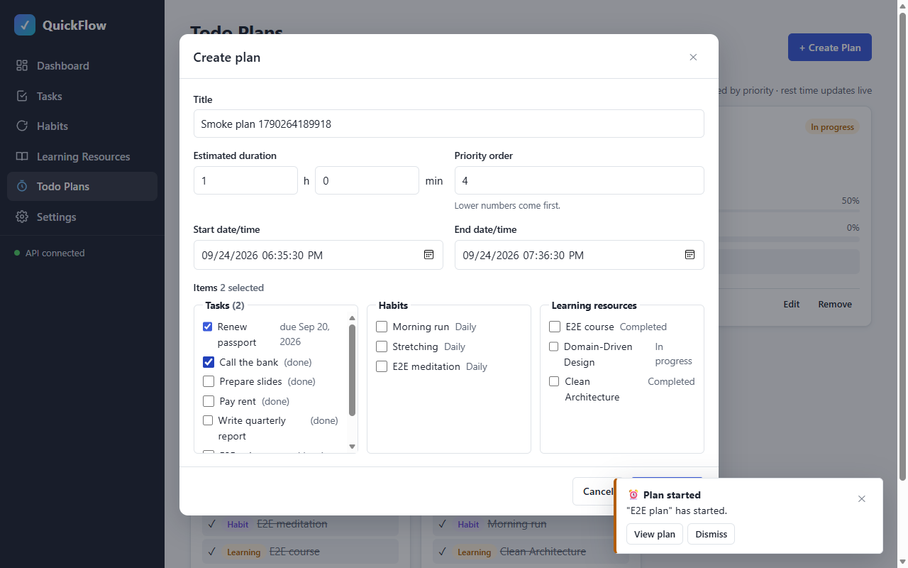

Root causes (frontend, not backend):
1. `#toasts` (z-index 60) is stacked above `.modal-backdrop` (z-index 50), so a sticky toast in the bottom-right corner covers the footer of a tall modal (plan builder) and blocks "Create plan".
2. The notifier shows "has started" for a plan whose items are all done (status Completed) — `GET /api/plans/notifications` still lists it until it is acknowledged or ends.

#### Console & network
- Console errors: 0 (`Total messages: 0 (Errors: 0, Warnings: 0)`)
- Failed requests: 0 (all logged writes 2xx)

**Result:** FAIL — phase checks 8/8 behaved as expected, but the smoke regression of phase-05 failed (real usability defect)
**Fix for attempt 2:** modal above toasts (z-index 70), toast container passes pointer events through except on the toasts themselves; notifier skips Completed plans. Re-run C1–C8 and all smoke checks.

### Attempt 2 — 2026-09-24T18:38:45+03:00
**Changes since attempt 1:** `css/styles.css` — `.modal-backdrop` z-index 50 → 70 (above `#toasts` 60); `#toasts` `pointer-events: none` with `.toast { pointer-events: auto }`. `lib/notifier.js` — plans with status Completed are not notified.
**Backend:** already running (health 200) — not started by loop
**Static server:** restarted — stop → serve → 200 on first poll
**Browser:** `browser_close` + fresh page, `browser_resize` 1280x800
**Test-data setup (curl):** `POST /api/tasks` "Buy flowers" (Todo, due today, id 35) → 201; `POST /api/habits` "Journal" (id 20) → 201 (so C3/C4 have an open task and an unchecked habit). C8 creates its data through the UI ("E2E v2 …").

| Check | Action (browser_run_code_unsafe: real clicks/fills) | Observation (verbatim) | Result |
|---|---|---|---|
| C1 [smoke] | goto `#/dashboard`; compare every metric card (value + subtitle) with in-page `GET /api/dashboard` | greeting `"Good evening, Hamada"`, displayName `"Hamada"`; `metricsMatchApi: true`; UI `{"tasks":"75% done \| 6 / 8 completed · 4 due today · 1 overdue","habits":"3 / 4 \| 75% of active habits completed","plans":"1 in progress \| 0 upcoming · 2 completed · avg 0% done","learning":"1 in progress \| 1 / 4 milestones (25%) · 1 in last 7 days"}` | **PASS** |
| C2 | lists vs API | dueToday `["Buy flowers","Prepare slides","Pay rent","Call the bank"]` equal: true; overdue `["Renew passport"]` equal: true; completedToday (6 titles) equal: true; habits `["Morning run","Stretching","E2E meditation","Journal"]` equal: true | **PASS** |
| C3 | click "Complete Buy flowers" | `POST /api/tasks/35/complete => 200`; `"75% done \| 6 / 8 …"` → `"88% done \| 7 / 8 completed · 4 due today · 1 overdue"` = API after; "Buy flowers" in Completed today: true | **PASS** |
| C4 | check "Journal" | `POST /api/habits/20/completions => 201`; `"3 / 4 \| 75% …"` → `"4 / 4 \| 100% of active habits completed"` = API after | **PASS** |
| C5 | two readings ≥ 5 s apart | `"Review notes \| 0 / 1 items 0% \| Rest 00:08:09 @2026-09-24T15:39:10.543Z"` → `"… Rest 00:08:04 @2026-09-24T15:39:15.769Z"`; API `rest=489` | **PASS** |
| C6 | learning panel vs API | UI `["Domain-Driven Design 1 / 2 · 50%"]`, API `["Domain-Driven Design 1/2 50%"]`; badge `"1 milestone done in 7 days"` (API last7 = 1) | **PASS** |
| C7 | each quick-add link from the dashboard | `["+ Task → #/tasks \| h1 \"Tasks\" \| dialog \"Add task\"","+ Habit → #/habits \| h1 \"Habits\" \| dialog \"Add habit\"","+ Learning card → #/learning \| h1 \"Learning Resources\" \| dialog \"Add learning card\"","+ Plan → #/plans \| h1 \"Todo Plans\" \| dialog \"Create plan\""]` | **PASS** |
| C8 | E2E (§11) entirely through the UI | see below | **PASS** |

**C8 detail** (writes: `POST /api/tasks => 201`, `POST /api/tasks/36/complete => 200`, `POST /api/tasks => 201`, `POST /api/habits => 201`, `POST /api/habits/21/completions => 201`, `POST /api/learning-cards => 201`, `POST …/17/milestones => 201` ×2, `POST /api/plans => 201`, `PATCH /api/plans/19/items/37|38|39 => 200`):

| Step | Observation |
|---|---|
| dashboard before | tasks `"88% done \| 7 / 8 …"`, habits `"4 / 4"`, plans `"1 in progress \| … 2 completed"`, active plans `["Review notes 0%"]` |
| 1 create + complete task | `["E2E v2 review report \| Todo","E2E v2 write report \| Done"]` |
| 2 create + complete habit | `"🔥 Streak 1Total 1Last done Today"` |
| 3 card with milestones | `"0 / 2 milestones"` |
| 4 plan from task + habit + card | element on top of the builder's submit button: `"Create plan"` (fix works); card `"In progress \| 0 / 3 items done 0%"`; dashboard: tasks `"80% done \| 8 / 10"`, habits `"5 / 5"`, plans `"2 in progress"`, active plans `["Review notes 0%","E2E v2 plan 0%"]`, "E2E v2 write report" in Completed today |
| 5 mark 1 item done | dashboard: active plans `["Review notes 0%","E2E v2 plan 33%"]`, plans `"… avg 17% done"`, tasks `"90% done \| 9 / 10"`, "E2E v2 review report" in Completed today (BR-13) |
| 5 mark all done | plan history `"Completed \| 3 / 3 items done 100%"` |
| 6 dashboard after | plans `"1 in progress \| 0 upcoming · 3 completed"`, active plans `["Review notes 0%"]`; no "has started" toast for the completed plan after an 11 s poll (`[]`) |
| sources after | task `"E2E v2 review report Done"`, habit `completedToday=true`, card `"Completed"`, history `"Completed 100%"` |

Screenshots: 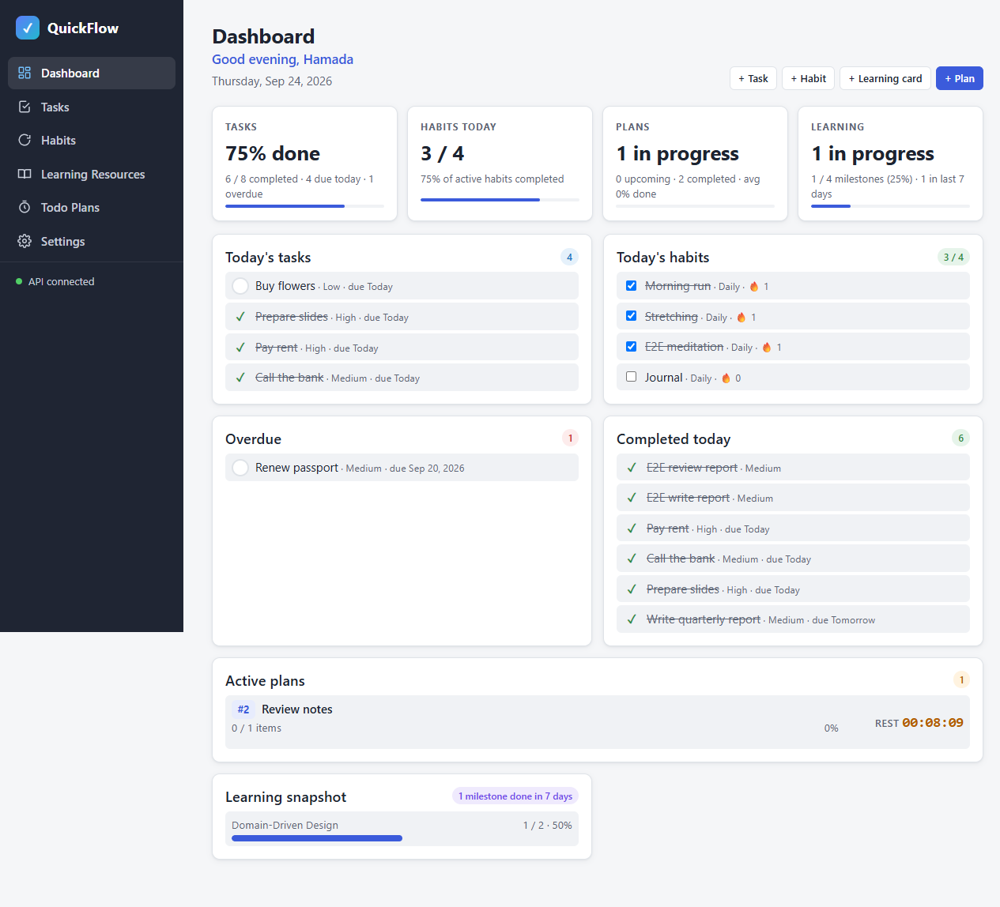 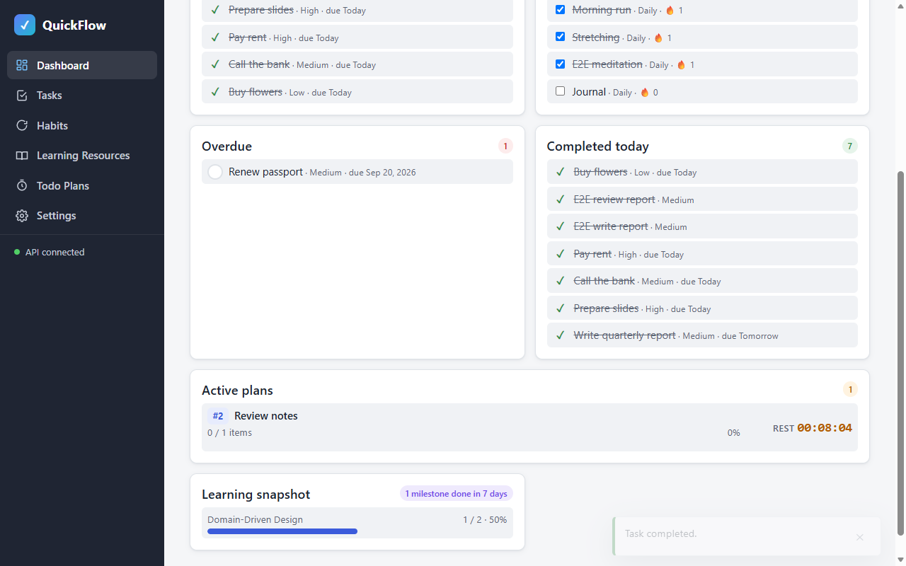 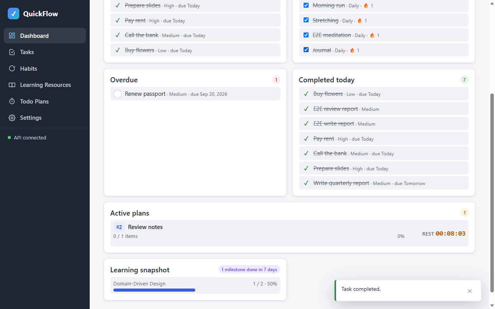 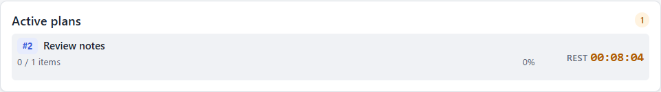 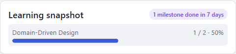 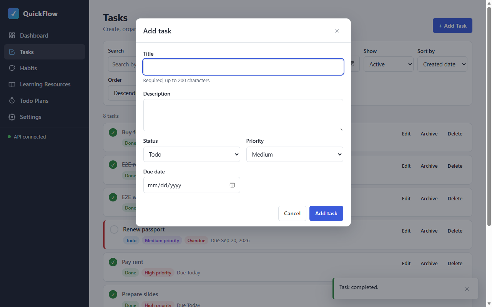 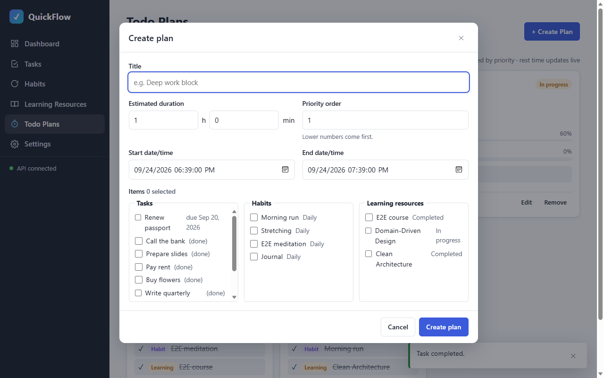 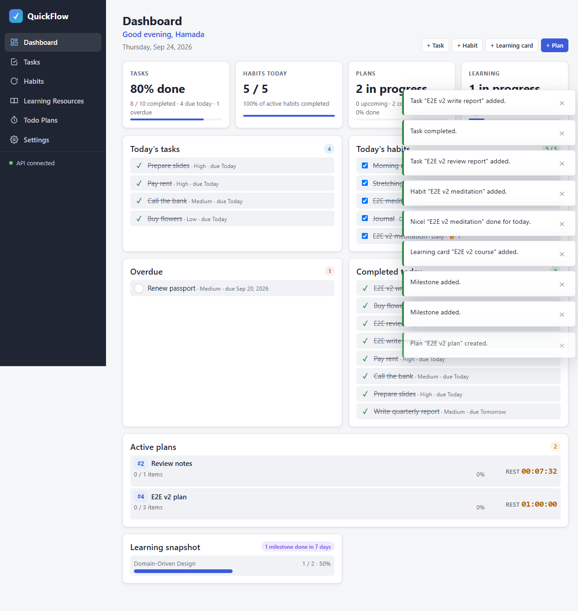 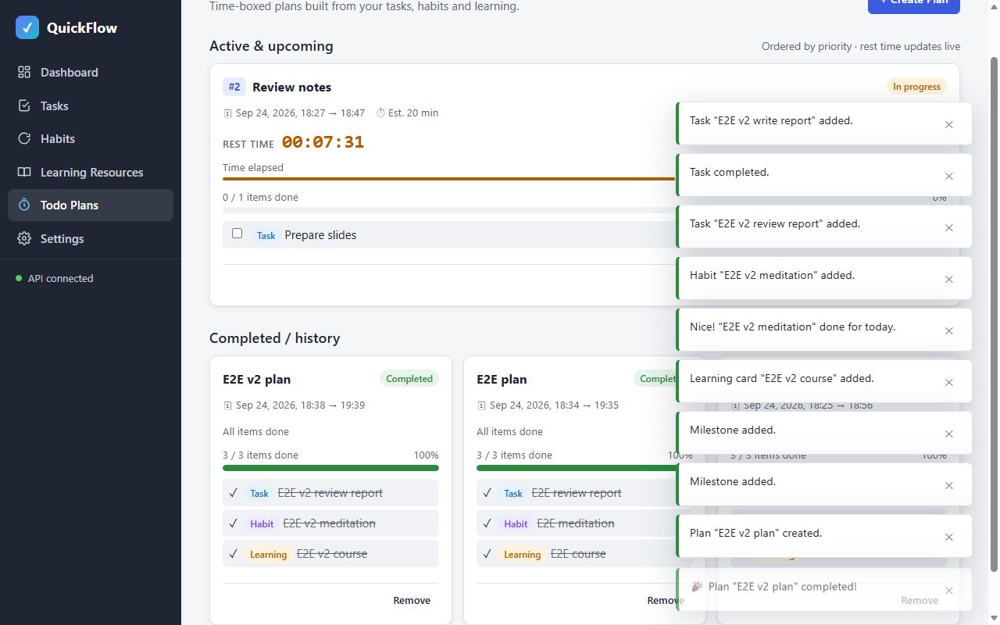 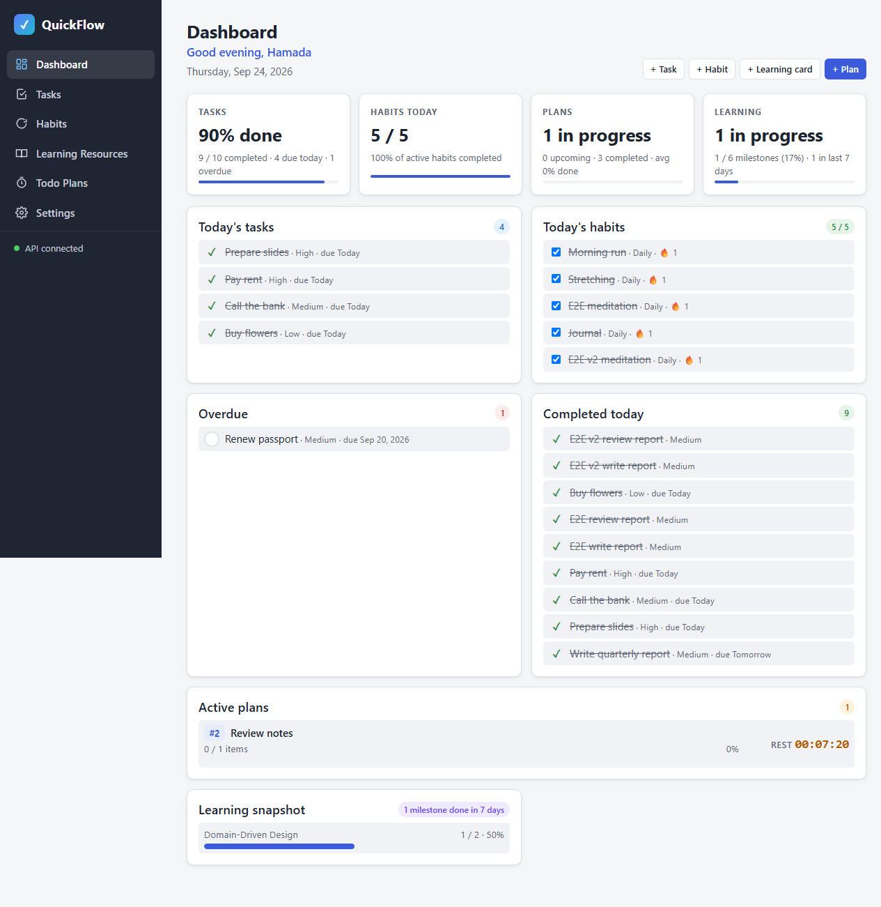

#### Console & network
- Console errors: 0 — `browser_console_messages` (all, since the fresh page): `Total messages: 0 (Errors: 0, Warnings: 0)`
- Failed requests: 0 — 126 requests since the last load saved via `browser_network_requests`, `grep -v '=> \[2'` → none; all logged writes above 2xx

#### Smoke regression
| Check | Result | Observation |
|---|---|---|
| **phase-05 C1/C5 (failed in attempt 1)** | PASS | `{"C1":"builder \"Create plan\" with 19 selectable sources","C5":"created \"Smoke plan 1790264409581\", start toast shown, item toggled → 50%, rest time 01:00:00 → 00:59:59, removed (start toast closed)"}` |
| phase-01 C1/C2/C4 | PASS | 6 links; `["#/tasks Tasks active=Tasks", …, "#/dashboard Dashboard active=Dashboard"]`; `"API connected"` |
| phase-02 C1/C9 | PASS | `{"C1":"empty state → dialog \"Add task\"","C9":"created and deleted \"Smoke task 1790264416279\"; rows now: 10"}` |
| phase-03 C1/C8 | PASS | `{"C1":"empty state \"No inactive habits\" → dialog \"Add habit\"","C8":"created, completed (🔥 Streak 1), removed \"Smoke habit 1790264420052\""}` |
| phase-04 C1/C9 | PASS | `{"C1":"filter \"NotStarted\": \"No not started cards\" → dialog \"Add learning card\"","C9":"created (0 / 1 milestones), removed \"Smoke card 1790264423301\""}` |
| phase-06 C1 ([smoke/phase-06.js](smoke/phase-06.js)) | PASS | `{"expected":{"tasks":"100% done","habits":"5 / 5","plans":"1 in progress","learning":"1 in progress"},"actual":{…identical…}}` |

Screenshot: 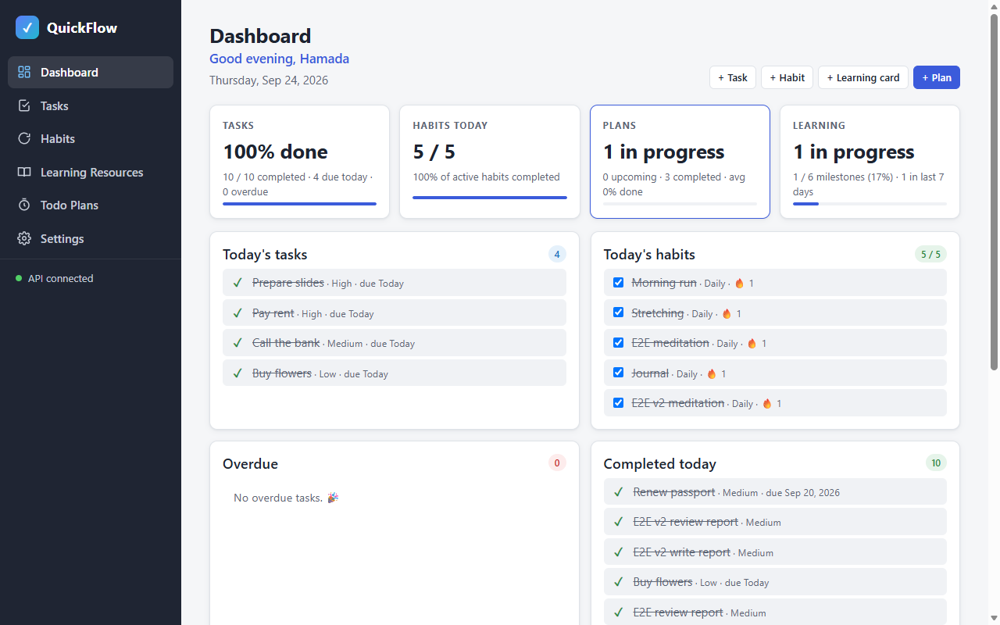

**Unit tests:** `tests/plan-time.test.html` unchanged (26/26 in phase-05)
**Teardown:** `browser_close` → "No open tabs"; frontend stop → port 5500 curl 000; backend left running
**Result:** PASS 8/8

## Unit tests (optional)
- Command: —
- Result: —

## Failure record
—

## Notes
- Attempt 1 failed on the phase-05 smoke regression: a sticky plan-start toast covered the footer of the tall plan-builder modal. Fixed in attempt 2 (modal stacks above toasts, toast container is click-through). The notifier also no longer reminds about plans whose items are all done.
- Test data seeded through the API for C1–C4 (open tasks due today / overdue, unchecked habits, an in-progress card with milestones); the §11 E2E data was created through the UI.
- The phase-05 smoke marks the first listed task done through a plan item (BR-13), so dashboard task numbers keep moving between runs; the dashboard smoke compares against the live API, so this doesn't affect it.
- Later-phase regression: [smoke/phase-06.js](smoke/phase-06.js).
