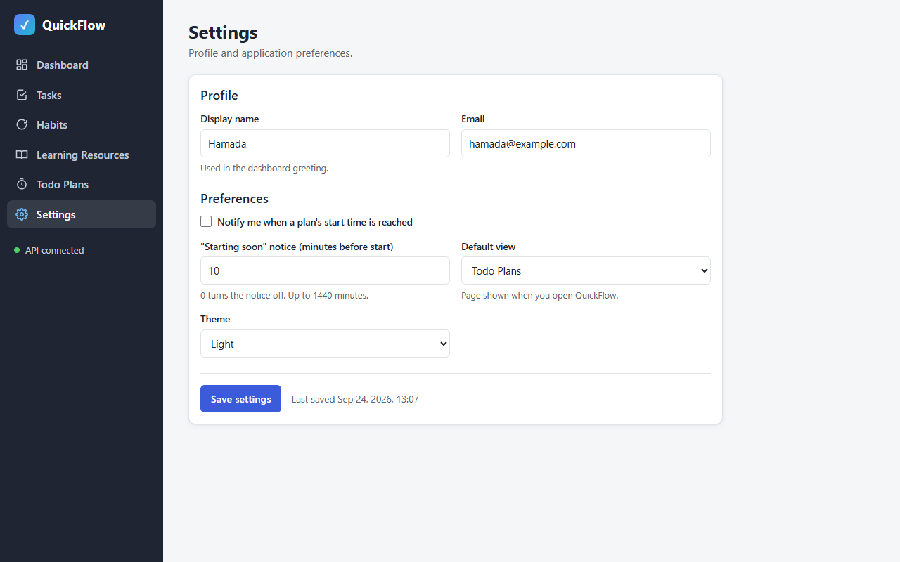
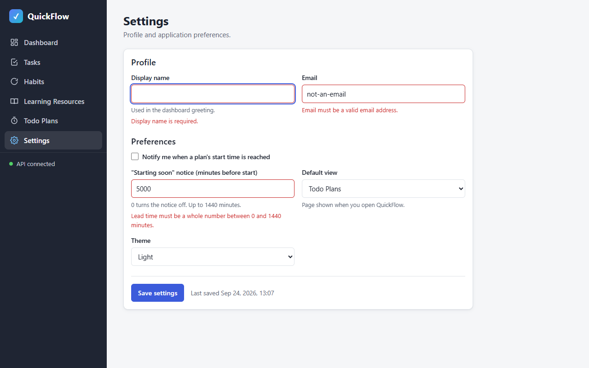
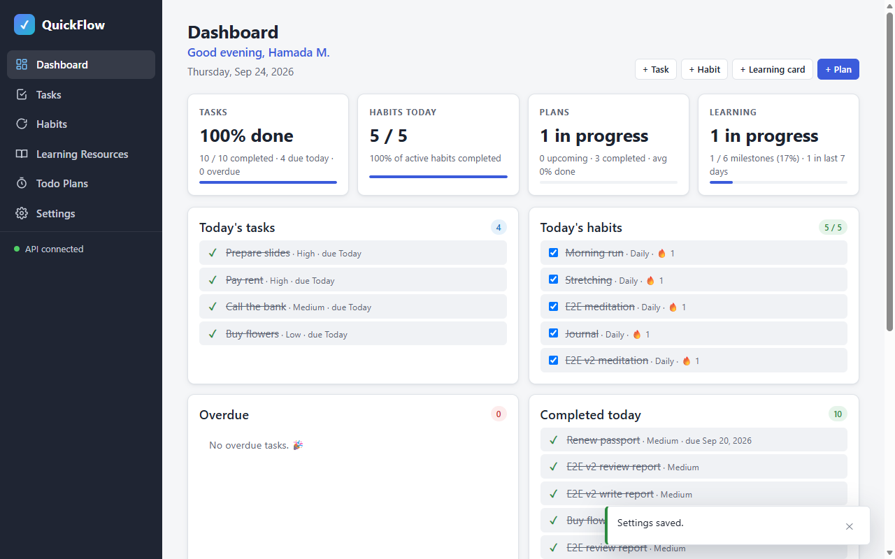
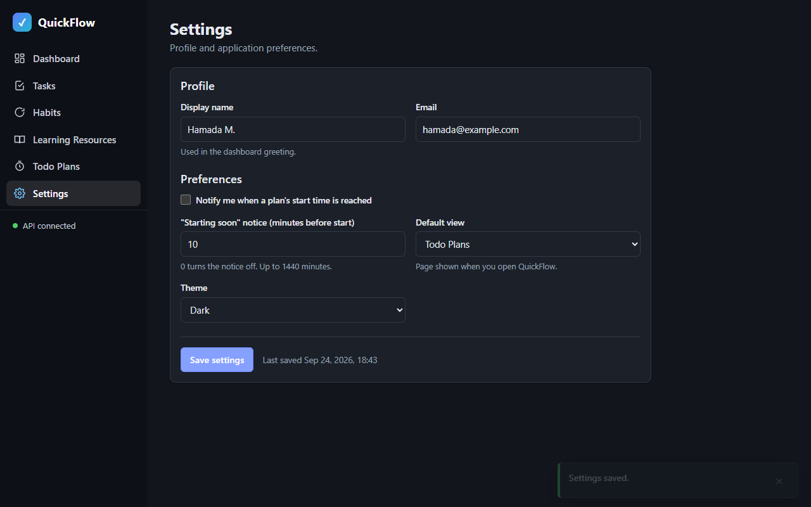
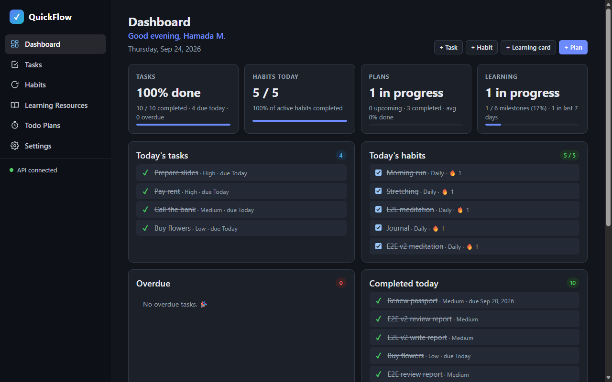
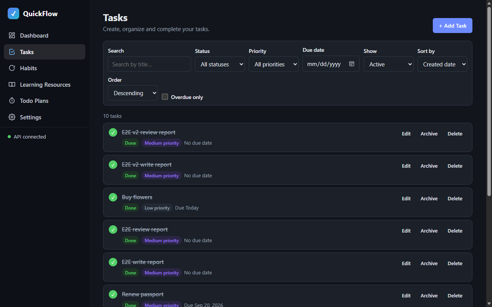
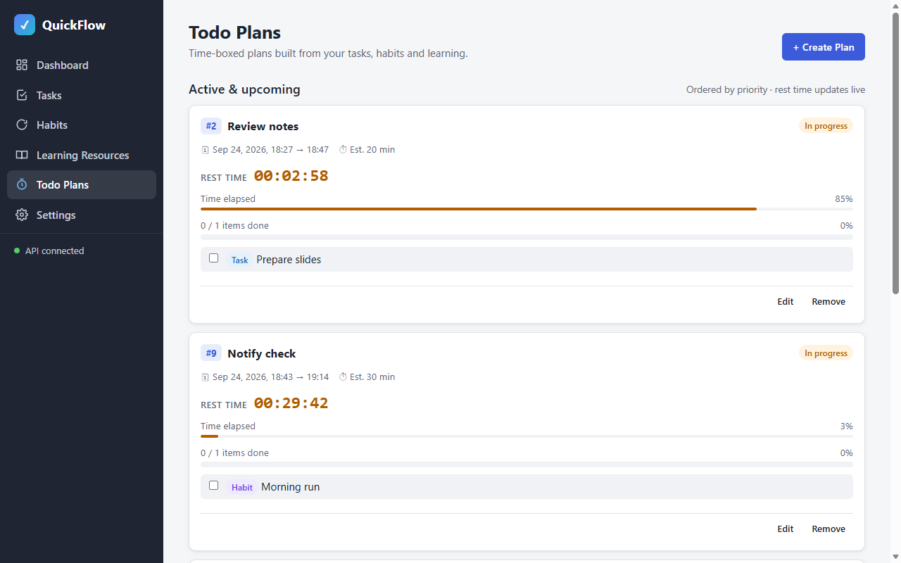
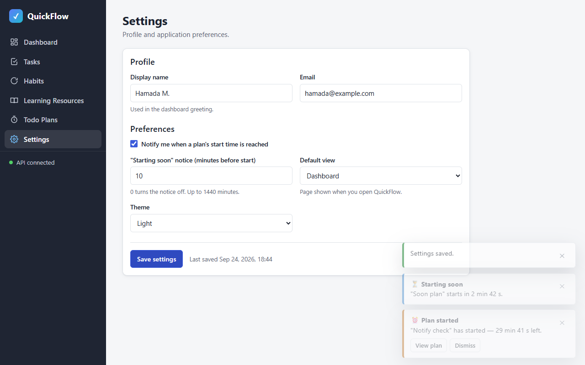
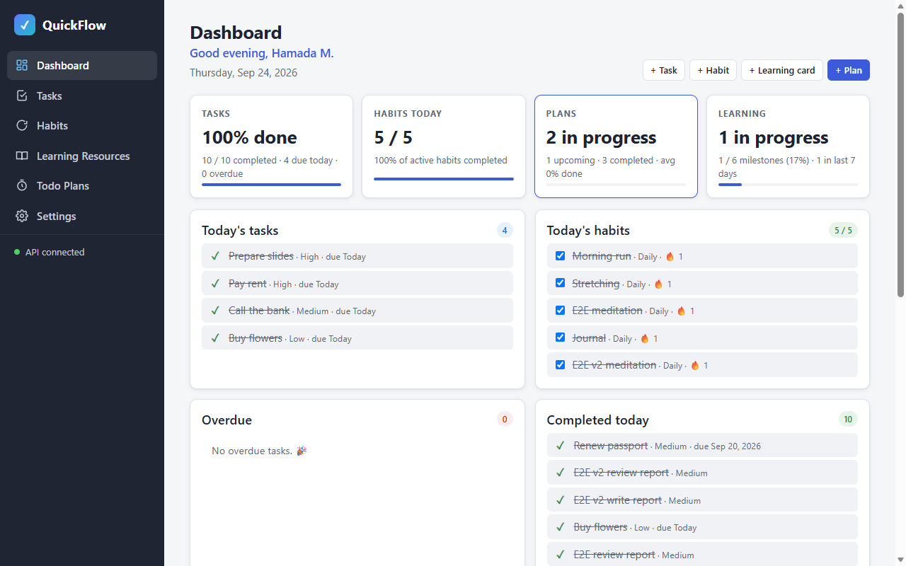

# phase-07-settings — Settings page

| Field | Value |
|---|---|
| Loop | frontend-dev |
| Status | completed |
| Attempts | 1 / 3 |
| Depends on | phase-06-dashboard |
| Requirements covered | §4 Settings, §8 Settings Page (profile, notification behavior, default view), FR-08 notification preference |
| Requirements source | docs/Task_PRD.md |
| Started | 2026-09-24T18:42:11+03:00 |
| Ended | 2026-09-24T18:45:31+03:00 |

## Goal
Users view and edit their profile (display name, email) and preferences (plan start notifications, lead minutes,
default view, theme); the app applies them: greeting, theme, default landing page and notification behavior.

## Tasks
<!-- Mark [x] only when the task is implemented AND covered by a passing check. -->
- [x] T1 Settings form: display name (required ≤100), email (valid, ≤200), plan-start notifications toggle, lead minutes (0–1440), default view, theme
- [x] T2 Save (`PUT /api/settings`) with client validation and server ProblemDetails display
- [x] T3 Apply theme (Light/Dark/System) through `data-theme` on `<html>`
- [x] T4 Opening the app without a route lands on the saved default view
- [x] T5 Notifier honors the notifications toggle and shows a "starting soon" notice within the lead minutes
- [x] T6 Dashboard greeting uses the saved display name

## Acceptance checks
- [x] C1 [smoke] The settings form shows the values from `GET /api/settings`
- [x] C2 Validation: empty display name, invalid email and lead minutes 5000 show errors and send no request
- [x] C3 Saving a new display name shows a success toast; the dashboard greeting uses it
- [x] C4 Choosing theme "Dark" applies `data-theme="dark"` (dark background) and persists after reload
- [x] C5 With default view "Tasks", opening the app root lands on `#/tasks`
- [x] C6 With notifications off, a started plan shows no toast; with them on, the toast appears
- [x] C7 A plan starting within the lead minutes shows a "starting soon" notice

## Verification

### Attempt 1 — 2026-09-24T18:43:20+03:00
**Backend:** already running (health 200) — not started by loop
**Static server:** PASS (`npx --yes http-server frontend -p 5500 -c-1 --silent` → 200 on first poll)
**Browser:** `browser_resize` 1280x800 (fresh page after phase-06 teardown)
**Initial settings (API):** `{"displayName":"Hamada","email":"hamada@example.com","planStartNotificationsEnabled":false,"notificationLeadMinutes":10,"defaultView":"TodoPlans","theme":"Light"}`
**Test-data setup (curl):** for C6/C7 `POST /api/plans` "Notify check" (started 30 s ago, not acknowledged, id 21) and "Soon plan" (starts in 180 s, id 22) → 201. Afterwards both were deleted (`DELETE /api/plans/21`, `/22` → 204) and the display name was restored to "Hamada" via `PUT /api/settings`.

| Check | Action (browser_run_code_unsafe: real clicks/fills) | Observation (verbatim) | Result |
|---|---|---|---|
| C1 [smoke] | goto `#/settings`; compare form with in-page `GET /api/settings` | form `{"displayName":"Hamada","email":"hamada@example.com","planStartNotificationsEnabled":false,"notificationLeadMinutes":10,"defaultView":"TodoPlans","theme":"Light"}`, equal to API: true | **PASS** |
| C2 | display name "", email "not-an-email", lead 5000 → Save settings | `{"sf-name":"Display name is required.","sf-email":"Email must be a valid email address.","sf-lead":"Lead time must be a whole number between 0 and 1440 minutes."}`; requests sent `[]` | **PASS** |
| C3 | name "Hamada M." (email/lead valid) → Save; nav Dashboard | `PUT /api/settings => 200`; toast `"Settings saved."`; field errors 0; greeting `"Good evening, Hamada M."` | **PASS** |
| C4 | Theme = Dark → Save; reload | before `{"dataTheme":"light","bodyBg":"rgb(245, 246, 248)"}` → after save `{"dataTheme":"dark","bodyBg":"rgb(18, 21, 28)","cardBg":"rgb(27, 32, 41)","text":"rgb(230, 233, 239)"}` → after reload identical, select `"Dark"` | **PASS** |
| C5 | Default view = Tasks → Save; open `http://localhost:5500/` (after about:blank) | `{"url":"http://localhost:5500/#/tasks","h1":"Tasks","active":"Tasks"}`; then restored Dashboard + Light → root `#/dashboard`, `dataTheme "light"` (`PUT /api/settings => 200` ×3) | **PASS** |
| C6 | notifications OFF: load `#/plans`, wait 12 s; then Settings → check "Notify me…" → Save | OFF: `Prefs…planStartNotificationsEnabled false`, toasts `[]` although the server still lists `["E2E plan","E2E v2 plan","Notify check"]` as pending (the only notifications GET in that window was the check's own call @15:44:21, the poller made none); ON: `PUT /api/settings => 200` → immediate poll → toast `"⏰ Plan started\n\"Notify check\" has started — 29 min 41 s left."`; Dismiss → `POST /api/plans/21/notifications/ack => 200` | **PASS** |
| C7 | same session, lead 10 min | `GET /api/plans?status=NotStarted => 200`; toast `"⏳ Starting soon\n\"Soon plan\" starts in 2 min 42 s."`; `Prefs.leadMinutes() = 10` | **PASS** |

Screenshots:         

#### Console & network
- Console errors: 0 — `Total messages: 0 (Errors: 0, Warnings: 0)`
- Failed requests: 0 — 100 requests since the last load saved via `browser_network_requests`, `grep -v '=> \[2'` → none

#### Smoke regression
| Check | Result | Observation |
|---|---|---|
| phase-07 C1 (new script) | PASS | form = API `{"displayName":"Hamada M.","email":"hamada@example.com","planStartNotificationsEnabled":true,"notificationLeadMinutes":10,"defaultView":"Dashboard","theme":"Light"}`, `dataTheme "light"` |
| phase-01 C1/C2/C4 | PASS | root → `#/dashboard` (default view Dashboard), 6 links, 6 routes active, "API connected" |
| phase-02 C1/C9 | PASS | `created and deleted "Smoke task 1790264686297"` |
| phase-03 C1/C8 | PASS | `created, completed (🔥 Streak 1), removed "Smoke habit 1790264690165"` |
| phase-04 C1/C9 | PASS | `created (0 / 1 milestones), removed "Smoke card 1790264697166"` |
| phase-05 C1/C5 | PASS | `created "Smoke plan 1790264701007", start toast shown, item toggled → 50%, rest time 01:00:00 → 00:59:58, removed (start toast closed)` (notifications now enabled) |
| phase-06 C1 | PASS | greeting `"Good evening, Hamada M."`; metrics = API `{"tasks":"100% done","habits":"5 / 5","plans":"2 in progress","learning":"1 in progress"}` |

Screenshot: 

**Unit tests:** `tests/plan-time.test.html` unchanged (26/26 in phase-05)
**Teardown:** `browser_close` → "No open tabs"; frontend stop → port 5500 curl 000; backend left running (not started by loop)
**Result:** PASS 7/7

## Unit tests (optional)
- Command: —
- Result: —

## Failure record
—

## Notes
- New shared module `js/lib/prefs.js` applies settings app-wide (theme, default route, notification gate). The app starts the router after settings load, and still starts with defaults if the load fails.
- The "starting soon" notice is computed client-side from `GET /api/plans?status=NotStarted` (`secondsUntilStart` ≤ lead minutes), because `GET /api/plans/notifications` only reports plans that have already started.
- Settings at the end of the run: notifications on, lead 10 min, default view Dashboard, theme Light, display name "Hamada" (restored via API). The phase-05 smoke needs notifications on.
- Later-phase regression: [smoke/phase-07.js](smoke/phase-07.js).
